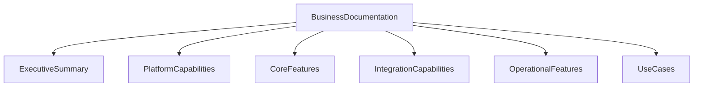

# vNext Business Documentation (Issue #330) – Structure + Migration Plan

## Goals

- Produce a **business-focused**, **English-only** documentation set for the vNext Workflow Engine based on issue #330 ([issue link](https://github.com/burgan-tech/vnext/issues/330)).
- Treat the current `doc/` tree as **archived** (it currently contains developer docs in `doc/en` and `doc/tr`).
- Keep a stable, memorable structure so each document can be referenced later without losing context.

## Inputs observed in repo

- Current developer docs live at:
  - `[doc/en/README.md](/Users/U06347/Documents/repos/burgan-tech/vnext-runtime/doc/en/README.md)`
  - `[doc/tr/README.md](/Users/U06347/Documents/repos/burgan-tech/vnext-runtime/doc/tr/README.md)`
- Root README currently links to these developer docs: `[README.md](/Users/U06347/Documents/repos/burgan-tech/vnext-runtime/README.md)`

## Target documentation structure (derived from Issue #330)

### High-level navigation (matches issue flowchart)

- Executive Summary
- Platform Capabilities
- Core Features
- Integration Options / Capabilities
- Use Cases

### Expanded structure (matches issue outline + bullets)

Recommended new root: `docs/business/` (new) and archive root: `doc-archive/` (old `doc/`).

Proposed files under `docs/business/`:

- `README.md`
  - Purpose, audience, navigation
  - One-paragraph “What is vNext Workflow Engine?”
  - Link list to all sections below
- `executive-summary.md`
  - What is vNext Workflow Engine
  - Key value propositions
  - Target audience
  - Typical business problems it solves
- `platform-capabilities.md`
  - Workflow definition and management
  - State machine with conditional transitions
  - Multi-tenant architecture (multi-schema)
  - Hierarchical workflows (SubFlows, SubProcesses)
  - Real-time and asynchronous execution
- `core-features.md`
  - Workflow engine
    - State management
    - Transition pipeline
    - Condition evaluation
    - Error handling
  - Task types
    - HTTP tasks
    - Dapr service calls
    - Script execution
    - Human tasks (if supported; otherwise describe as “planned/extension pattern” with clear labeling)
    - Timer/scheduled tasks
  - Scripting engine
    - Dynamic C# scripts
    - Data transformation
    - Business logic
  - Integration (feature-level overview)
    - REST APIs
    - Dapr runtime
    - Event-driven
    - Service discovery
  - Operations (feature-level overview)
    - Caching
    - Metrics
    - Logging
    - Tracing
  - Explicit bullets called out by issue
    - Scripting Engine (dynamic C#)
    - Auto Transitions
    - Timer Execution
    - Instance Filtering
    - Caching Strategy
    - Service Discovery
- `integration-capabilities.md`
  - REST API for external systems
  - Dapr integration for microservices
  - Event-driven architecture support
  - Multi-domain routing
- `operational-features.md`
  - OpenTelemetry integration (Logging, Tracing, Metrics)
  - Health monitoring
  - Background job processing
  - Inbox/Outbox pattern for reliability
- `use-cases.md`
  - A set of business-oriented scenarios, each with:
    - Problem statement
    - Why workflow engine fits
    - Proposed workflow shape (high level)
    - Integration touchpoints
    - Operational considerations
  - Suggested starter use case categories:
    - Customer onboarding / KYC
    - Loan origination / credit approvals
    - Payment and collections orchestration
    - Claims processing
    - Internal approvals (procurement, access requests)

### Optional (nice-to-have) sub-structure if you want more granularity later

- `use-cases/` folder (split into separate markdown files per use case)
- `diagrams/` folder for mermaid or exported images

## Migration strategy (archiving `doc/`)

### Archive approach (recommended default)

- Rename/move existing `doc/` → `doc-archive/`.
- Keep existing language structure intact inside the archive:
  - `doc-archive/en/**`
  - `doc-archive/tr/**`

### Link strategy

- Update `[README.md](/Users/U06347/Documents/repos/burgan-tech/vnext-runtime/README.md)` and `[README.tr.md](/Users/U06347/Documents/repos/burgan-tech/vnext-runtime/README.tr.md)` to:
  - Point “Developer docs” to the archived location (or explicitly say “Archived developer documentation”).
  - Introduce new “Business Documentation (EN)” entry pointing to `docs/business/README.md`.

### Naming note

- Using `docs/` for new docs avoids confusion with the archived `doc-archive/` and makes it clear these are the active docs going forward.

## Content sourcing plan (how we’ll fill each doc)

- Use issue #330 as the canonical outline.
- Where possible, reuse *concept descriptions* already present in archived docs (e.g., state/transition/task terminology) but rewrite for business audience.
- Keep a consistent “business-first” template in each document:
  - What it is
  - Why it matters
  - Key capabilities
  - Example business outcomes
  - Integration/operations notes

## Acceptance criteria

- `doc/` is preserved under an archive path (no loss of historical developer documentation).
- New English-only business docs exist under a single predictable root with stable filenames.
- Root readmes contain clear links to **Business docs** and **Archived developer docs**.

## Mermaid overview (navigation)

