# Database Architecture

## Database Isolation at Domain Level

In the vNext Runtime platform, each domain has its own independent database. This approach ensures complete data isolation between domains and is critical for security and data integrity.

### Database Isolation Principles

```
┌──────────────────────────────────────────┐
│         vNext Platform                   │
├──────────────────────────────────────────┤
│                                          │
│  ┌────────────────┐  ┌────────────────┐ │
│  │ Onboarding     │  │ IDM            │ │
│  │ Domain         │  │ Domain         │ │
│  │                │  │                │ │
│  │ ┌────────────┐ │  │ ┌────────────┐ │ │
│  │ │onboarding  │ │  │ │ idm_db     │ │ │
│  │ │_db         │ │  │ │            │ │ │
│  │ └────────────┘ │  │ └────────────┘ │ │
│  └────────────────┘  └────────────────┘ │
│                                          │
│  ┌────────────────┐  ┌────────────────┐ │
│  │ Notification   │  │ Payment        │ │
│  │ Domain         │  │ Domain         │ │
│  │                │  │                │ │
│  │ ┌────────────┐ │  │ ┌────────────┐ │ │
│  │ │notification│ │  │ │ payment_db │ │ │
│  │ │_db         │ │  │ │            │ │ │
│  │ └────────────┘ │  │ └────────────┘ │ │
│  └────────────────┘  └────────────────┘ │
│                                          │
└──────────────────────────────────────────┘
```

**Core Principles:**
- Each domain = One database
- Direct database access between domains is prohibited
- Data sharing occurs only through API or Events
- Each domain implements its own data governance policies

## Multi-Flow Schema Structure

vNext Runtime uses a **multi-flow schema** (multi-schema) approach within the database. This structure organizes database objects for different flows and system components.

### System Schemas

When the platform starts, **6 fundamental system schemas** are automatically created:

#### 1. sys_flows
```sql
-- Schema where flow definitions are stored
sys_flows
```
**Content:** Workflow definitions, state structures, transition rules, version information.

#### 2. sys_views
```sql
-- Schema where view definitions are stored
sys_views
```
**Content:** UI view definitions, templates, platform overrides.

#### 3. sys_functions
```sql
-- Schema where function APIs are stored
sys_functions
```
**Content:** System functions (State, Data, View APIs), authorization rules.

#### 4. sys_tasks
```sql
-- Schema where task definitions are stored
sys_tasks
```
**Content:** Definitions of HTTP, Script, Timer, Condition, and other task types.

#### 5. sys_extensions
```sql
-- Schema where extensions and plugins are stored
sys_extensions
```
**Content:** System extensions, custom plugins, extension points.

#### 6. sys_schemas
```sql
-- Schema where schema metadata is stored
sys_schemas
```
**Content:** Registry of all schemas, migration history, version tracking.

## Flow-Specific Schemas (Dynamic Schemas)

Per-flow database schemas hold instance data and history. As of **v0.0.42**, schema **creation and migration** for a flow are driven by a **DB-Migrator job** at **deploy time**, not by running migration checks on every **start** or **transition** request.

### Deploy-time schema lifecycle (v0.0.42+)

```
Flow / runtime deploy → DB-Migrator job runs → Schemas created or migrated → Runtime serves traffic
```

**Example:**
```
Deployment: customer-onboarding flow (v1.0.0)
↓
DB-Migrator job runs in the deployment pipeline
↓
Schema customer_onboarding is created or brought up to date
↓
Migration scripts run as needed
↓
Flow is ready before first business start/transition
```

## Automatic Migration System

Schema changes are applied in a controlled way via the **migrator** and **`sys_schemas`** history—not by coupling migration to each API request.

### First deployment

```
Flow is deployed for the first time
↓
Schema does not exist yet
↓
DB-Migrator job (or equivalent deploy step) creates the schema
↓
Tables, indexes, and seeds are applied
↓
Instance start/transition no longer triggers migrate checks (v0.0.42+)
```

### System upgrade

```
vNext Runtime new version
↓
Deploy pipeline runs DB-Migrator (or platform checks sys_schemas.migration_history)
↓
Missing migrations are detected
↓
Migration scripts are executed
↓
Migration history is updated per schema
↓
System is up to date
```

## Database Architecture Diagram

```mermaid
graph TB
    subgraph services["vNext Services"]
        orchestration["vnext-app<br/>(Orchestration)"]
        execution["vnext-execution-app<br/>(Execution)"]
        init["vnext-init<br/>(Initialization)"]
    end
    
    subgraph database["Domain Database (PostgreSQL)"]
        subgraph system["System Schemas"]
            sys_flows["sys_flows<br/><i>Workflow definitions</i>"]
            sys_views["sys_views<br/><i>View definitions</i>"]
            sys_functions["sys_functions<br/><i>Function APIs</i>"]
            sys_tasks["sys_tasks<br/><i>Task definitions</i>"]
            sys_extensions["sys_extensions<br/><i>Extensions</i>"]
            sys_schemas["sys_schemas<br/><i>Schema registry</i>"]
        end
        
        subgraph flows["Flow Schemas"]
            flow1["customer_onboarding<br/><i>Instances, data, history</i>"]
            flow2["payment_process<br/><i>Instances, data, history</i>"]
            flow3["document_approval<br/><i>Instances, data, history</i>"]
        end
    end
    
    orchestration -->|Read definitions| sys_flows
    orchestration -->|Read views| sys_views
    orchestration -->|Read tasks| sys_tasks
    orchestration -->|CRUD operations| flow1
    orchestration -->|CRUD operations| flow2
    orchestration -->|CRUD operations| flow3
    
    execution -->|Read data| flow1
    execution -->|Read data| flow2
    execution -->|Read data| flow3
    
    init -->|Schema DDL & Migration| sys_schemas
    init -->|Seed flows| sys_flows
    init -->|Seed tasks| sys_tasks
    init -->|Create on first run| flow1
    init -->|Create on first run| flow2
    init -->|Create on first run| flow3
    
    style database fill:#e1f5ff
    style system fill:#fff4e6
    style flows fill:#f3e5f5
    style services fill:#e8f5e9
```



## Conclusion

vNext Runtime's multi-schema database architecture enables independent data management for each domain and each flow. The automatic schema creation and migration system allows developers to focus on workflows without dealing with database management.

## Related Documentation

- [Domain Topology](./domain-topology.md) - Domain-level isolation
- [Services](./services.md) - Service architecture and database interaction

