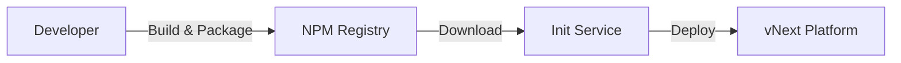

# vNext Init Service

vNext Init Service is the central service that manages platform component deployment operations. This service enables developers to deploy their workflow packages to the platform.

## 📋 Table of Contents

- [Overview](#overview)
- [Component Types](#component-types)
- [Deployment Flow](#deployment-flow)
- [API Endpoints](#api-endpoints)
- [Package Publish Examples](#package-publish-examples)

---

## Overview

vNext Init Service performs the following operations:

1. **Package Download**: Downloads packages from NPM or other artifact systems
2. **Version Creation**: Manages versions with semantic versioning strategy
3. **Component Deploy**: Deploys all component types to the platform

### How It Works



1. The developer's repository is first **built** and packaged
2. The package is uploaded to **NPM** or any artifact system
3. The `version` field in `vnext.config.json` is semantically versioned
4. Init service downloads this package and deploys it to the platform

---

## Component Types

Init Service is used to deploy the following component types:

| Component | Description |
|-----------|-------------|
| **flows** | Workflow definitions |
| **tasks** | Task definitions |
| **schemas** | Data schema definitions |
| **extensions** | Extension components |
| **functions** | Function definitions |
| **views** | View definitions |

---

## Deployment Flow

### 1. Package Preparation

```bash
# Build the project
npm run build

# Create the package
npm pack
```

### 2. Versioning

Update the version field in `vnext.config.json`:

```json
{
  "name": "my-workflow-package",
  "version": "1.0.0",
  "domain": "my-domain"
}
```

> **Note**: For detailed information on versioning strategy: [Version Management](../principles/versioning.md)

### 3. Upload to NPM

```bash
npm publish --registry https://your-registry.com
```

### 4. Deploy with Init Service

Init service downloads the package and deploys it to the platform using the `/api/v1/definitions/publish` endpoint.

---

## API Endpoints

### Health Check

Checks the health status of the service and platform.

```http
GET /health
Accept: application/json
```

**Response:**
```json
{
  "status": "healthy",
  "timestamp": "2025-01-15T10:30:00Z"
}
```

---

### Package Publish

Deploys the package to the platform.

```http
POST /api/package/publish
Content-Type: application/json
```

**Request Body:**

| Field | Type | Required | Description |
|-------|------|----------|-------------|
| `packageName` | string | ✅ | NPM package name (e.g., `@my-org/my-workflow-package`) |
| `version` | string | ✅ | Semantic version (e.g., `1.0.0`) |
| `appDomain` | string | ❌ | Used for domain replacement |
| `npmRegistry` | string | ❌ | Custom NPM registry URL |
| `npmToken` | string | ❌ | Authentication token for private registry |

---

## Package Publish Examples

### Basic Usage

The simplest usage - just package name and version:

```http
POST /api/package/publish
Content-Type: application/json

{
  "packageName": "@my-org/my-workflow-package",
  "version": "1.0.0"
}
```

---

### With Domain Replacement

To specify the domain where the package will be deployed:

```http
POST /api/package/publish
Content-Type: application/json

{
  "packageName": "@my-org/my-workflow-package",
  "version": "1.0.0",
  "appDomain": "my-custom-domain"
}
```

---

### With Custom NPM Registry

To use a custom NPM registry:

```http
POST /api/package/publish
Content-Type: application/json

{
  "packageName": "@my-org/my-workflow-package",
  "version": "1.0.0",
  "npmRegistry": "https://registry.your-company.com"
}
```

---

### Private Registry (With Token)

Using authentication token for private NPM registry:

```http
POST /api/package/publish
Content-Type: application/json

{
  "packageName": "@my-org/my-workflow-package",
  "version": "1.0.0",
  "npmRegistry": "https://registry.your-company.com",
  "npmToken": "your-npm-token-here"
}
```

---

### Full Configuration

Comprehensive example with all parameters:

```http
POST /api/package/publish
Content-Type: application/json

{
  "packageName": "@my-org/my-workflow-package",
  "version": "1.0.0",
  "npmRegistry": "https://registry.your-company.com",
  "npmToken": "your-npm-token-here",
  "appDomain": "production"
}
```

---

## Definitions Publish Endpoint

The endpoint used to directly deploy platform components. This endpoint is used internally by the init service to upload components to the platform after the package is downloaded.

```http
POST /api/v1/definitions/publish
Content-Type: application/json
```

### Request Body

| Field | Type | Required | Description |
|-------|------|----------|-------------|
| `key` | string | ✅ | Component unique key |
| `flow` | string | ✅ | Associated flow name |
| `domain` | string | ✅ | Target domain |
| `version` | string | ✅ | Semantic version |
| `tags` | string[] | ❌ | Component tags |
| `attributes` | object | ✅ | Component content |
| `data` | array | ❌ | Seed data (initial records) |

**Example Request:**

```json
{
  "key": "my-component",
  "flow": "my-flow",
  "domain": "my-domain",
  "version": "1.0.0",
  "tags": ["production", "v1"],
  "attributes": {
    // Component content
  },
  "data": [
    {
      "key": "seed-record-1",
      "version": "1.0.0",
      "tags": ["initial"],
      "attributes": {}
    }
  ]
}
```

### Response Codes

#### ✅ 200 OK - Success

Component deployed successfully.

---

#### ⚠️ 400 Bad Request - Validation Error

Returned when component validation fails.

```json
{
  "type": "https://httpstatuses.com/400/validation/App/900006",
  "title": "Bad Request",
  "status": 400,
  "detail": "Component validation failed for type 'sys-flows'",
  "instance": "/api/v1/definitions/publish",
  "errors": {
    "workflow.States": [
      "Workflow must contain exactly one initial state. Found: 2."
    ]
  },
  "errorCode": "validation.App:900006",
  "prefix": "validation",
  "code": "App:900006",
  "traceId": "00-75d0de9d505f79e60997909aa47bc2ec-a9b2e4f305bff2b6-01"
}
```

**Common Validation Errors:**
- Multiple initial states defined in workflow
- Required fields missing
- Invalid component structure

---

#### ❌ 409 Conflict - Version Conflict

Returned when the same version already exists.

```json
{
  "type": "https://httpstatuses.com/409/conflict/Instance/100002",
  "title": "Conflict",
  "status": 409,
  "detail": "A record with the same version already exists.",
  "instance": "/api/v1/definitions/publish",
  "errorCode": "conflict.Instance:100002",
  "prefix": "conflict",
  "code": "Instance:100002",
  "traceId": "00-cc2fa21cbe77902da014702864c563f8-e62547f41765a292-01"
}
```

**Solution:** Update the version field in `vnext.config.json` to create a new version.

---

---

## Server Timeout Configuration (v0.0.31+)

For long-running publish operations (large packages, many components), you can configure server timeouts using environment variables.

### Environment Variables

| Variable | Description | Default |
|----------|-------------|---------|
| `SERVER_TIMEOUT_MS` | Total request timeout in milliseconds | `600000` (10 min) |
| `SERVER_KEEP_ALIVE_TIMEOUT_MS` | Keep-alive connection timeout in milliseconds | `600000` (10 min) |
| `SERVER_HEADERS_TIMEOUT_MS` | Headers timeout in milliseconds (must be > keep-alive) | `610000` (10 min + 10 sec) |

### Configuration Examples

**Docker Compose (30 minute timeout):**

```yaml
services:
  vnext-init:
    environment:
      SERVER_TIMEOUT_MS: 1800000        # 30 minutes
      SERVER_KEEP_ALIVE_TIMEOUT_MS: 1800000
      SERVER_HEADERS_TIMEOUT_MS: 1810000
```

**Docker Run:**

```bash
docker run -e SERVER_TIMEOUT_MS=1800000 \
           -e SERVER_KEEP_ALIVE_TIMEOUT_MS=1800000 \
           -e SERVER_HEADERS_TIMEOUT_MS=1810000 \
           your-image
```

> **Tip:** If you're experiencing timeout errors during package publishing, try increasing these values. The `SERVER_HEADERS_TIMEOUT_MS` should always be slightly larger than `SERVER_KEEP_ALIVE_TIMEOUT_MS`.

---

## Automatic Cache Invalidation (v0.0.31+)

After each component deployment, the platform automatically triggers a re-initialize operation to clear the cache. This ensures that:

- Cached workflow definitions are refreshed
- Updated components are immediately available
- No stale cache issues occur after deployment

> **Note:** This behavior is automatic and requires no additional configuration.

---

## Gateway Base URL Support - UrlTemplates Configuration (v0.0.36+)

When deploying vNext platform behind an API gateway, you can configure custom URL templates for Hateoas-style response links. This ensures that instance URLs returned in API responses match your gateway's routing configuration.

### Configuration

Add the `UrlTemplates` section to your `appsettings.json`:

```json
{
  "UrlTemplates": {
    "Start": "/api/{0}/workflows/{1}/instances/start",
    "Transition": "/api/{0}/workflows/{1}/instances/{2}/transitions/{3}",
    "FunctionList": "/api/{0}/workflows/{1}/functions/{2}",
    "InstanceList": "/api/{0}/workflows/{1}/instances",
    "Instance": "/api/{0}/workflows/{1}/instances/{2}",
    "InstanceHistory": "/api/{0}/workflows/{1}/instances/{2}/transitions",
    "Data": "/api/{0}/workflows/{1}/instances/{2}/functions/data",
    "View": "/api/{0}/workflows/{1}/instances/{2}/functions/view",
    "Schema": "/api/{0}/workflows/{1}/instances/{2}/functions/schema?transitionKey={3}"
  }
}
```

### Template Parameters

Each template uses positional parameters that are replaced at runtime:

| Parameter | Description | Example |
|-----------|-------------|---------|
| `{0}` | Domain | `ecommerce` |
| `{1}` | Workflow/Flow name | `payment-processing` |
| `{2}` | Instance ID | `18075ad5-e5b2-4437-b884-21d733339113` |
| `{3}` | Transition key or context-specific parameter | `approve`, `reject` |

### Template Descriptions

| Template | Purpose | Generated URL Example |
|----------|---------|----------------------|
| **Start** | Start new instance endpoint | `/api/ecommerce/workflows/payment-processing/instances/start` |
| **Transition** | Trigger transition on instance | `/api/ecommerce/workflows/payment-processing/instances/abc-123/transitions/approve` |
| **FunctionList** | List available functions | `/api/ecommerce/workflows/payment-processing/functions/view` |
| **InstanceList** | List workflow instances | `/api/ecommerce/workflows/payment-processing/instances` |
| **Instance** | Get specific instance | `/api/ecommerce/workflows/payment-processing/instances/abc-123` |
| **InstanceHistory** | Get instance transition history | `/api/ecommerce/workflows/payment-processing/instances/abc-123/transitions` |
| **Data** | Get instance data | `/api/ecommerce/workflows/payment-processing/instances/abc-123/functions/data` |
| **View** | Get instance view | `/api/ecommerce/workflows/payment-processing/instances/abc-123/functions/view` |
| **Schema** | Get transition schema | `/api/ecommerce/workflows/payment-processing/instances/abc-123/functions/schema?transitionKey=approve` |

### Use Cases

**Scenario 1: Gateway with Path Prefix**

If your gateway routes vNext API through a specific path:

```json
{
  "UrlTemplates": {
    "Start": "/vnext-api/v1/{0}/workflows/{1}/instances/start",
    "Instance": "/vnext-api/v1/{0}/workflows/{1}/instances/{2}"
  }
}
```

**Scenario 2: Different Domain Structure**

If your gateway organizes routes differently:

```json
{
  "UrlTemplates": {
    "Start": "/domains/{0}/flows/{1}/start",
    "Transition": "/domains/{0}/flows/{1}/instances/{2}/execute/{3}"
  }
}
```

**Scenario 3: Subdomain-based Routing**

If domains are mapped to subdomains at the gateway level:

```json
{
  "UrlTemplates": {
    "Start": "/api/workflows/{1}/instances/start",
    "Instance": "/api/workflows/{1}/instances/{2}"
  }
}
```

> **Note:** The domain parameter (`{0}`) can be omitted from templates if your gateway handles domain routing via subdomains.

### Benefits

- ✅ **Cross-Domain Routing**: Support multiple domains behind a single gateway
- ✅ **Client Simplicity**: Clients can follow Hateoas links without URL manipulation
- ✅ **Gateway Flexibility**: Adapt to any gateway routing configuration
- ✅ **API Versioning**: Easy URL structure changes without breaking clients using Hateoas

### Default Behavior

If `UrlTemplates` is not configured, the platform uses default templates that match the standard vNext API structure:

```
/api/{domain}/workflows/{workflow}/instances/...
```

> **Reference:** [#327 - Support gateway base URL in InstanceUrlTemplates for cross-domain routing](https://github.com/burgan-tech/vnext/issues/327)

---

## Service Discovery Configuration (v0.0.33+)

### Localhost Validation in Production

Starting with v0.0.33, the platform validates Service Discovery configuration on startup to prevent common misconfiguration issues.

**Validation Rules:**

| Environment | Localhost Allowed | Behavior |
|-------------|-------------------|----------|
| Development | ✅ Yes | Localhost addresses accepted |
| Production | ❌ No | Application fails to start |

**Blocked Addresses in Production:**
- `localhost`
- `127.0.0.1`
- `::1`

**Configuration Example:**

```json
{
  "vNextApi": {
    "BaseUrl": "https://api.production.com",
    "ServiceDiscovery": {
      "Enabled": true
    }
  }
}
```

**Error Message:**
```
FATAL: Service Discovery configuration error
vNextApi:BaseUrl cannot point to localhost in production environment.
Current value: http://localhost:4201
Environment: Production

Please update the configuration to use a resolvable network address.
```

**Why This Matters:**
- Prevents deployment of misconfigured services
- Ensures service mesh can reach the application
- Fail-fast behavior catches configuration errors early

> **Reference:** [#313 - Fail fast when vNextApi:BaseUrl points to localhost in production](https://github.com/burgan-tech/vnext/issues/313)

---

### Service Discovery Registration Failure Handling

When Service Discovery is enabled, the application now enforces successful registration before continuing startup.

**Fail-Fast Behavior:**

| Scenario | Behavior |
|----------|----------|
| Service Discovery enabled + Registration successful | ✅ Normal operation |
| Service Discovery enabled + Registration failed | ❌ Application crashes immediately |
| Service Discovery disabled | No validation performed |

**Error Handling:**

```
FATAL: Service Discovery registration failed
Cannot proceed without successful service registration.

Details:
- Service Discovery Endpoint: https://discovery.prod.com
- Registration Timeout: 30s
- Error: Connection timeout

Check:
1. Network connectivity to Service Discovery endpoint
2. Service Discovery endpoint configuration
3. Firewall rules and network policies
4. DNS resolution for the endpoint
```

**Configuration Check:**

```json
{
  "ServiceDiscovery": {
    "Enabled": true,
    "Endpoint": "https://discovery.production.com",
    "RetryAttempts": 3,
    "RetryDelay": "PT5S"
  }
}
```

**Why This Matters:**
- Prevents services from running in partially configured state
- Ensures microservice deployments are fully integrated with service mesh
- Detects infrastructure issues immediately during deployment
- Prevents silent failures in distributed systems

**Troubleshooting:**

1. **Verify Service Discovery Endpoint:**
   ```bash
   curl https://discovery.production.com/health
   ```

2. **Check Network Connectivity:**
   ```bash
   ping discovery.production.com
   ```

3. **Review Application Logs:**
   ```bash
   docker logs vnext-app-core | grep "Service Discovery"
   ```

4. **Temporarily Disable (Development Only):**
   ```json
   {
     "ServiceDiscovery": {
       "Enabled": false
     }
   }
   ```

> **Reference:** [#325 - Refactor: Move service discovery enable check into RegisterDomainAsync and add failure handling](https://github.com/burgan-tech/vnext/issues/325)

---

## Related Documentation

- [Version Management](../principles/versioning.md) - Versioning strategy
- [Platform Fundamentals](../fundamentals/readme.md) - Platform structure
- [Domain Topology](../fundamentals/domain-topology.md) - Domain architecture

