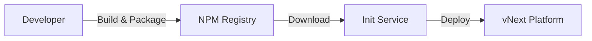

# vNext Init Service

vNext Init Service is the central service that manages platform component deployment operations. This service enables developers to deploy their workflow packages to the platform.

## 📋 Table of Contents

- [Overview](#overview)
- [Component Types](#component-types)
- [Deployment Flow](#deployment-flow)
- [API Endpoints](#api-endpoints)
- [Package Publish Examples](#package-publish-examples)

---

## Overview

vNext Init Service performs the following operations:

1. **Package Download**: Downloads packages from NPM or other artifact systems
2. **Version Creation**: Manages versions with semantic versioning strategy
3. **Component Deploy**: Deploys all component types to the platform

### How It Works



1. The developer's repository is first **built** and packaged
2. The package is uploaded to **NPM** or any artifact system
3. The `version` field in `vnext.config.json` is semantically versioned
4. Init service downloads this package and deploys it to the platform

---

## Component Types

Init Service is used to deploy the following component types:

| Component | Description |
|-----------|-------------|
| **flows** | Workflow definitions |
| **tasks** | Task definitions |
| **schemas** | Data schema definitions |
| **extensions** | Extension components |
| **functions** | Function definitions |
| **views** | View definitions |

---

## Deployment Flow

### 1. Package Preparation

```bash
# Build the project
npm run build

# Create the package
npm pack
```

### 2. Versioning

Update the version field in `vnext.config.json`:

```json
{
  "name": "my-workflow-package",
  "version": "1.0.0",
  "domain": "my-domain"
}
```

> **Note**: For detailed information on versioning strategy: [Version Management](../principles/versioning.md)

### 3. Upload to NPM

```bash
npm publish --registry https://your-registry.com
```

### 4. Deploy with Init Service

Init service downloads the package and deploys it to the platform using the `/api/v1/definitions/publish` endpoint.

---

## API Endpoints

### Health Check

Checks the health status of the service and platform.

```http
GET /health
Accept: application/json
```

**Response:**
```json
{
  "status": "healthy",
  "timestamp": "2025-01-15T10:30:00Z"
}
```

---

### Package Publish

Deploys the package to the platform.

```http
POST /api/package/publish
Content-Type: application/json
```

**Request Body:**

| Field | Type | Required | Description |
|-------|------|----------|-------------|
| `packageName` | string | ✅ | NPM package name (e.g., `@my-org/my-workflow-package`) |
| `version` | string | ✅ | Semantic version (e.g., `1.0.0`) |
| `appDomain` | string | ❌ | Used for domain replacement |
| `npmRegistry` | string | ❌ | Custom NPM registry URL |
| `npmToken` | string | ❌ | Authentication token for private registry |

---

## Package Publish Examples

### Basic Usage

The simplest usage - just package name and version:

```http
POST /api/package/publish
Content-Type: application/json

{
  "packageName": "@my-org/my-workflow-package",
  "version": "1.0.0"
}
```

---

### With Domain Replacement

To specify the domain where the package will be deployed:

```http
POST /api/package/publish
Content-Type: application/json

{
  "packageName": "@my-org/my-workflow-package",
  "version": "1.0.0",
  "appDomain": "my-custom-domain"
}
```

---

### With Custom NPM Registry

To use a custom NPM registry:

```http
POST /api/package/publish
Content-Type: application/json

{
  "packageName": "@my-org/my-workflow-package",
  "version": "1.0.0",
  "npmRegistry": "https://registry.your-company.com"
}
```

---

### Private Registry (With Token)

Using authentication token for private NPM registry:

```http
POST /api/package/publish
Content-Type: application/json

{
  "packageName": "@my-org/my-workflow-package",
  "version": "1.0.0",
  "npmRegistry": "https://registry.your-company.com",
  "npmToken": "your-npm-token-here"
}
```

---

### Full Configuration

Comprehensive example with all parameters:

```http
POST /api/package/publish
Content-Type: application/json

{
  "packageName": "@my-org/my-workflow-package",
  "version": "1.0.0",
  "npmRegistry": "https://registry.your-company.com",
  "npmToken": "your-npm-token-here",
  "appDomain": "production"
}
```

---

## Definitions Publish Endpoint

The endpoint used to directly deploy platform components. This endpoint is used internally by the init service to upload components to the platform after the package is downloaded.

```http
POST /api/v1/definitions/publish
Content-Type: application/json
```

### Request Body

| Field | Type | Required | Description |
|-------|------|----------|-------------|
| `key` | string | ✅ | Component unique key |
| `flow` | string | ✅ | Associated flow name |
| `domain` | string | ✅ | Target domain |
| `version` | string | ✅ | Semantic version |
| `tags` | string[] | ❌ | Component tags |
| `attributes` | object | ✅ | Component content |
| `data` | array | ❌ | Seed data (initial records) |

**Example Request:**

```json
{
  "key": "my-component",
  "flow": "my-flow",
  "domain": "my-domain",
  "version": "1.0.0",
  "tags": ["production", "v1"],
  "attributes": {
    // Component content
  },
  "data": [
    {
      "key": "seed-record-1",
      "version": "1.0.0",
      "tags": ["initial"],
      "attributes": {}
    }
  ]
}
```

### Response Codes

#### ✅ 200 OK - Success

Component deployed successfully.

---

#### ⚠️ 400 Bad Request - Validation Error

Returned when component validation fails.

```json
{
  "type": "https://httpstatuses.com/400/validation/App/900006",
  "title": "Bad Request",
  "status": 400,
  "detail": "Component validation failed for type 'sys-flows'",
  "instance": "/api/v1/definitions/publish",
  "errors": {
    "workflow.States": [
      "Workflow must contain exactly one initial state. Found: 2."
    ]
  },
  "errorCode": "validation.App:900006",
  "prefix": "validation",
  "code": "App:900006",
  "traceId": "00-75d0de9d505f79e60997909aa47bc2ec-a9b2e4f305bff2b6-01"
}
```

**Common Validation Errors:**
- Multiple initial states defined in workflow
- Required fields missing
- Invalid component structure

---

#### ❌ 409 Conflict - Version Conflict

Returned when the same version already exists.

```json
{
  "type": "https://httpstatuses.com/409/conflict/Instance/100002",
  "title": "Conflict",
  "status": 409,
  "detail": "A record with the same version already exists.",
  "instance": "/api/v1/definitions/publish",
  "errorCode": "conflict.Instance:100002",
  "prefix": "conflict",
  "code": "Instance:100002",
  "traceId": "00-cc2fa21cbe77902da014702864c563f8-e62547f41765a292-01"
}
```

**Solution:** Update the version field in `vnext.config.json` to create a new version.

---

## Related Documentation

- [Version Management](../principles/versioning.md) - Versioning strategy
- [Platform Fundamentals](../fundamentals/readme.md) - Platform structure
- [Domain Topology](../fundamentals/domain-topology.md) - Domain architecture

