# Veritabanı Mimarisi

## Domain Seviyesinde Veritabanı İzolasyonu

vNext Runtime platformunda her domain, kendi bağımsız veritabanına sahiptir. Bu yaklaşım, domain'ler arası tam veri izolasyonu sağlar ve güvenlik ile veri bütünlüğü açısından kritik öneme sahiptir.

### Veritabanı İzolasyonunun Prensipleri

```
┌──────────────────────────────────────────┐
│         vNext Platform                   │
├──────────────────────────────────────────┤
│                                          │
│  ┌────────────────┐  ┌────────────────┐ │
│  │ Onboarding     │  │ IDM            │ │
│  │ Domain         │  │ Domain         │ │
│  │                │  │                │ │
│  │ ┌────────────┐ │  │ ┌────────────┐ │ │
│  │ │onboarding  │ │  │ │ idm_db     │ │ │
│  │ │_db         │ │  │ │            │ │ │
│  │ └────────────┘ │  │ └────────────┘ │ │
│  └────────────────┘  └────────────────┘ │
│                                          │
│  ┌────────────────┐  ┌────────────────┐ │
│  │ Notification   │  │ Payment        │ │
│  │ Domain         │  │ Domain         │ │
│  │                │  │                │ │
│  │ ┌────────────┐ │  │ ┌────────────┐ │ │
│  │ │notification│ │  │ │ payment_db │ │ │
│  │ │_db         │ │  │ │            │ │ │
│  │ └────────────┘ │  │ └────────────┘ │ │
│  └────────────────┘  └────────────────┘ │
│                                          │
└──────────────────────────────────────────┘
```

**Temel Prensipler:**
- Her domain = Bir veritabanı
- Domain'ler arası direkt veritabanı erişimi yasaktır
- Veri paylaşımı sadece API veya Event üzerinden olur
- Her domain kendi data governance politikalarını uygular

## Multi-Flow Şema Yapısı

vNext Runtime, veritabanı içinde **multi-flow şema** (multi-schema) yaklaşımını kullanır. Bu yapı, farklı flow'ların ve sistem bileşenlerinin veritabanı objelerini organize eder.

### Sistem Şemaları (System Schemas)

Platform başlatıldığında otomatik olarak **6 temel sistem şeması** oluşturulur:

#### 1. sys_flows
```sql
-- Flow tanımlarının saklandığı şema
sys_flows
```
**İçerik:** Workflow tanımları, state yapıları, transition kuralları, versiyon bilgileri.

#### 2. sys_views
```sql
-- View tanımlarının saklandığı şema
sys_views
```
**İçerik:** UI view tanımları, şablonlar, platform override'ları.

#### 3. sys_functions
```sql
-- Function API'lerinin saklandığı şema
sys_functions
```
**İçerik:** Sistem function'ları (State, Data, View API'leri), yetkilendirme kuralları.

#### 4. sys_tasks
```sql
-- Task tanımlarının saklandığı şema
sys_tasks
```
**İçerik:** HTTP, Script, Timer, Condition ve diğer task türlerinin tanımları.

#### 5. sys_extensions
```sql
-- Extension ve plugin'lerin saklandığı şema
sys_extensions
```
**İçerik:** Sistem uzantıları, özel plugin'ler, genişletme noktaları.

#### 6. sys_schemas
```sql
-- Şema metadata'sının saklandığı şema
sys_schemas
```
**İçerik:** Tüm şemaların kaydı, migration geçmişi, versiyon takibi.

## Flow-Specific Şemalar (Dinamik Şemalar)

Bir flow sisteme deploy edildiğinde ve **ilk kez çalıştırıldığında**, o flow için otomatik olarak yeni bir şema oluşturulur.

### Otomatik Şema Oluşturma

```
Flow Deploy → İlk Instance Start → Şema Oluşturma
```

**Örnek:**
```
Deployment: customer-onboarding flow (v1.0.0)
↓
İlk çalıştırma tetiklenir
↓
Sistem otomatik olarak şema oluşturur: customer_onboarding
↓
Migration scriptleri otomatik çalıştırılır
↓
Flow hazır ve çalışır durumda
```

## Otomatik Migration Sistemi

vNext Runtime, şema değişikliklerini otomatik olarak yönetir.

### İlk Deploy (First Deployment)

```
Flow ilk kez deploy edilir
↓
Şema henüz yok
↓
İlk instance start komutu
↓
Sistem şemayı oluşturur
↓
Tüm tablolar ve index'ler oluşturulur
↓
Başlangıç data'sı yüklenir (seed)
```

### Sistem Upgrade (System Upgrade)

```
vNext Runtime yeni versiyon
↓
sys_schemas.migration_history kontrol edilir
↓
Eksik migration'lar tespit edilir
↓
Migration scriptleri otomatik çalıştırılır
↓
Her şema için migration history güncellenir
↓
Sistem güncel hale gelir
```

### Flow Versiyon Değişikliği

```
Flow v1.0.0 çalışıyor
↓
Flow v2.0.0 deploy edilir
↓
Şema değişikliği gerekli mi kontrol edilir
↓
Gerekirse migration çalıştırılır
↓
Her iki versiyon da desteklenir (Semantic Versioning)
```

## Database Architecture Diagram

```mermaid
graph TB
    subgraph services["vNext Services"]
        orchestration["vnext-app<br/>(Orchestration)"]
        execution["vnext-execution-app<br/>(Execution)"]
        init["vnext-init<br/>(Initialization)"]
    end
    
    subgraph database["Domain Database (PostgreSQL)"]
        subgraph system["System Schemas"]
            sys_flows["sys_flows<br/><i>Workflow definitions</i>"]
            sys_views["sys_views<br/><i>View definitions</i>"]
            sys_functions["sys_functions<br/><i>Function APIs</i>"]
            sys_tasks["sys_tasks<br/><i>Task definitions</i>"]
            sys_extensions["sys_extensions<br/><i>Extensions</i>"]
            sys_schemas["sys_schemas<br/><i>Schema registry</i>"]
        end
        
        subgraph flows["Flow Schemas"]
            flow1["customer_onboarding<br/><i>Instances, data, history</i>"]
            flow2["payment_process<br/><i>Instances, data, history</i>"]
            flow3["document_approval<br/><i>Instances, data, history</i>"]
        end
    end
    
    orchestration -->|Read definitions| sys_flows
    orchestration -->|Read views| sys_views
    orchestration -->|Read tasks| sys_tasks
    orchestration -->|CRUD operations| flow1
    orchestration -->|CRUD operations| flow2
    orchestration -->|CRUD operations| flow3
    
    execution -->|Read data| flow1
    execution -->|Read data| flow2
    execution -->|Read data| flow3
    
    init -->|Schema DDL & Migration| sys_schemas
    init -->|Seed flows| sys_flows
    init -->|Seed tasks| sys_tasks
    init -->|Create on first run| flow1
    init -->|Create on first run| flow2
    init -->|Create on first run| flow3
    
    style database fill:#e1f5ff
    style system fill:#fff4e6
    style flows fill:#f3e5f5
    style services fill:#e8f5e9
```




## Sonuç

vNext Runtime'ın multi-schema veritabanı mimarisi, her domain'in ve her flow'un bağımsız veri yönetimine olanak tanır. Otomatik şema oluşturma ve migration sistemi, geliştiricilerin veritabanı yönetimiyle uğraşmadan iş akışlarına odaklanmasını sağlar.

## İlgili Dökümanlar

- [Domain Topology](./domain-topology.md) - Domain seviyesinde izolasyon
- [Persistence](../principles/persistance.md) - Veri saklama prensipleri

