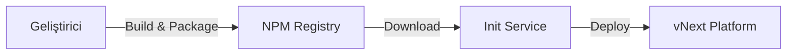

# vNext Init Service

vNext Init Service, platform bileşenlerinin deployment işlemlerini yöneten merkezi servistir. Bu servis, geliştiricilerin hazırladıkları workflow paketlerini platforma deploy etmelerini sağlar.

## 📋 İçindekiler

- [Genel Bakış](#genel-bakış)
- [Bileşen Türleri](#bileşen-türleri)
- [Deployment Akışı](#deployment-akışı)
- [API Endpointleri](#api-endpointleri)
- [Package Publish Örnekleri](#package-publish-örnekleri)

---

## Genel Bakış

vNext Init Service, aşağıdaki işlemleri gerçekleştirir:

1. **Paket İndirme**: NPM veya diğer artifact sistemlerinden paketleri indirir
2. **Versiyon Oluşturma**: Semantik versiyonlama stratejisi ile versiyonları yönetir
3. **Bileşen Deploy**: Tüm bileşen türlerini platforma deploy eder

### Çalışma Yöntemi



1. Geliştiricinin platforma deploy etmek istediği repo önce **build** alınarak paketlenir
2. Paket **NPM** veya herhangi bir artifact sistemine yüklenir
3. `vnext.config.json` dosyasındaki `version` alanı semantik olarak versiyonlanır
4. Init service bu paketi indirir ve platforma deploy eder

---

## Bileşen Türleri

Init Service aşağıdaki bileşen türlerini deploy etmek için kullanılır:

| Bileşen | Açıklama |
|---------|----------|
| **flows** | İş akışı tanımlamaları |
| **tasks** | Görev tanımlamaları |
| **schemas** | Veri şema tanımlamaları |
| **extensions** | Extension bileşenleri |
| **functions** | Fonksiyon tanımlamaları |
| **views** | Görünüm tanımlamaları |

---

## Deployment Akışı

### 1. Paket Hazırlama

```bash
# Projeyi build edin
npm run build

# Paketi oluşturun
npm pack
```

### 2. Versiyonlama

`vnext.config.json` dosyasında version alanını güncelleyin:

```json
{
  "name": "my-workflow-package",
  "version": "1.0.0",
  "domain": "my-domain"
}
```

> **Not**: Versiyonlama stratejisi için detaylı bilgi: [Versiyon Yönetimi](../principles/versioning.md)

### 3. NPM'e Yükleme

```bash
npm publish --registry https://your-registry.com
```

### 4. Init Service ile Deploy

Init service paketi indirir ve `/api/v1/definitions/publish` endpointini kullanarak platforma deploy eder.

---

## API Endpointleri

### Health Check

Servis ve platform sağlık durumunu kontrol eder.

```http
GET /health
Accept: application/json
```

**Response:**
```json
{
  "status": "healthy",
  "timestamp": "2025-01-15T10:30:00Z"
}
```

---

### Package Publish

Paketi platforma deploy eder.

```http
POST /api/package/publish
Content-Type: application/json
```

**Request Body:**

| Alan | Tip | Zorunlu | Açıklama |
|------|-----|---------|----------|
| `packageName` | string | ✅ | NPM paket adı (örn: `@my-org/my-workflow-package`) |
| `version` | string | ✅ | Semantik versiyon (örn: `1.0.0`) |
| `appDomain` | string | ❌ | Domain değiştirme için kullanılır |
| `npmRegistry` | string | ❌ | Özel NPM registry URL'i |
| `npmToken` | string | ❌ | Private registry için authentication token |

---

## Package Publish Örnekleri

### Temel Kullanım

En basit kullanım şekli - sadece paket adı ve versiyonu:

```http
POST /api/package/publish
Content-Type: application/json

{
  "packageName": "@my-org/my-workflow-package",
  "version": "1.0.0"
}
```

---

### Domain Değiştirme ile

Paketin deploy edileceği domain'i belirtmek için:

```http
POST /api/package/publish
Content-Type: application/json

{
  "packageName": "@my-org/my-workflow-package",
  "version": "1.0.0",
  "appDomain": "my-custom-domain"
}
```

---

### Özel NPM Registry ile

Özel bir NPM registry kullanmak için:

```http
POST /api/package/publish
Content-Type: application/json

{
  "packageName": "@my-org/my-workflow-package",
  "version": "1.0.0",
  "npmRegistry": "https://registry.your-company.com"
}
```

---

### Private Registry (Token ile)

Private NPM registry için authentication token ekleyerek:

```http
POST /api/package/publish
Content-Type: application/json

{
  "packageName": "@my-org/my-workflow-package",
  "version": "1.0.0",
  "npmRegistry": "https://registry.your-company.com",
  "npmToken": "your-npm-token-here"
}
```

---

### Tam Konfigürasyon

Tüm parametreleri içeren kapsamlı örnek:

```http
POST /api/package/publish
Content-Type: application/json

{
  "packageName": "@my-org/my-workflow-package",
  "version": "1.0.0",
  "npmRegistry": "https://registry.your-company.com",
  "npmToken": "your-npm-token-here",
  "appDomain": "production"
}
```

---

## Definitions Publish Endpoint

Platform bileşenlerini doğrudan deploy etmek için kullanılan endpoint. Bu endpoint, init service tarafından paket indirildikten sonra bileşenleri platforma yüklemek için dahili olarak kullanılır.

```http
POST /api/v1/definitions/publish
Content-Type: application/json
```

### Request Body

| Alan | Tip | Zorunlu | Açıklama |
|------|-----|---------|----------|
| `key` | string | ✅ | Bileşen benzersiz anahtarı |
| `flow` | string | ✅ | İlişkili flow adı |
| `domain` | string | ✅ | Hedef domain |
| `version` | string | ✅ | Semantik versiyon |
| `tags` | string[] | ❌ | Bileşen etiketleri |
| `attributes` | object | ✅ | Bileşen içeriği |
| `data` | array | ❌ | Seed data (başlangıç verileri) |

**Örnek Request:**

```json
{
  "key": "my-component",
  "flow": "my-flow",
  "domain": "my-domain",
  "version": "1.0.0",
  "tags": ["production", "v1"],
  "attributes": {
    // Bileşen içeriği
  },
  "data": [
    {
      "key": "seed-record-1",
      "version": "1.0.0",
      "tags": ["initial"],
      "attributes": {}
    }
  ]
}
```

### Response Kodları

#### ✅ 200 OK - Başarılı

Bileşen başarıyla deploy edildi.

---

#### ⚠️ 400 Bad Request - Doğrulama Hatası

Bileşen doğrulaması başarısız olduğunda döner.

```json
{
  "type": "https://httpstatuses.com/400/validation/App/900006",
  "title": "Bad Request",
  "status": 400,
  "detail": "Component validation failed for type 'sys-flows'",
  "instance": "/api/v1/definitions/publish",
  "errors": {
    "workflow.States": [
      "Workflow must contain exactly one initial state. Found: 2."
    ]
  },
  "errorCode": "validation.App:900006",
  "prefix": "validation",
  "code": "App:900006",
  "traceId": "00-75d0de9d505f79e60997909aa47bc2ec-a9b2e4f305bff2b6-01"
}
```

**Yaygın Doğrulama Hataları:**
- Workflow'da birden fazla initial state tanımlanmış
- Zorunlu alanlar eksik
- Geçersiz bileşen yapısı

---

#### ❌ 409 Conflict - Versiyon Çakışması

Aynı versiyon zaten mevcut olduğunda döner.

```json
{
  "type": "https://httpstatuses.com/409/conflict/Instance/100002",
  "title": "Conflict",
  "status": 409,
  "detail": "A record with the same version already exists.",
  "instance": "/api/v1/definitions/publish",
  "errorCode": "conflict.Instance:100002",
  "prefix": "conflict",
  "code": "Instance:100002",
  "traceId": "00-cc2fa21cbe77902da014702864c563f8-e62547f41765a292-01"
}
```

**Çözüm:** `vnext.config.json` dosyasında version alanını güncelleyerek yeni bir versiyon oluşturun.

---

## İlgili Dökümanlar

- [Versiyon Yönetimi](../principles/versioning.md) - Versiyonlama stratejisi
- [Platform Temelleri](../fundamentals/readme.md) - Platform yapısı
- [Domain Topolojisi](../fundamentals/domain-topology.md) - Domain mimarisi

