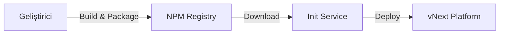

# vNext Init Service

vNext Init Service, platform bileşenlerinin deployment işlemlerini yöneten merkezi servistir. Bu servis, geliştiricilerin hazırladıkları workflow paketlerini platforma deploy etmelerini sağlar.

## 📋 İçindekiler

- [Genel Bakış](#genel-bakış)
- [Bileşen Türleri](#bileşen-türleri)
- [Deployment Akışı](#deployment-akışı)
- [API Endpointleri](#api-endpointleri)
- [Package Publish Örnekleri](#package-publish-örnekleri)

---

## Genel Bakış

vNext Init Service, aşağıdaki işlemleri gerçekleştirir:

1. **Paket İndirme**: NPM veya diğer artifact sistemlerinden paketleri indirir
2. **Versiyon Oluşturma**: Semantik versiyonlama stratejisi ile versiyonları yönetir
3. **Bileşen Deploy**: Tüm bileşen türlerini platforma deploy eder

### Çalışma Yöntemi



1. Geliştiricinin platforma deploy etmek istediği repo önce **build** alınarak paketlenir
2. Paket **NPM** veya herhangi bir artifact sistemine yüklenir
3. `vnext.config.json` dosyasındaki `version` alanı semantik olarak versiyonlanır
4. Init service bu paketi indirir ve platforma deploy eder

---

## Bileşen Türleri

Init Service aşağıdaki bileşen türlerini deploy etmek için kullanılır:

| Bileşen | Açıklama |
|---------|----------|
| **flows** | İş akışı tanımlamaları |
| **tasks** | Görev tanımlamaları |
| **schemas** | Veri şema tanımlamaları |
| **extensions** | Extension bileşenleri |
| **functions** | Fonksiyon tanımlamaları |
| **views** | Görünüm tanımlamaları |

---

## Deployment Akışı

### 1. Paket Hazırlama

```bash
# Projeyi build edin
npm run build

# Paketi oluşturun
npm pack
```

### 2. Versiyonlama

`vnext.config.json` dosyasında version alanını güncelleyin:

```json
{
  "name": "my-workflow-package",
  "version": "1.0.0",
  "domain": "my-domain"
}
```

> **Not**: Versiyonlama stratejisi için detaylı bilgi: [Versiyon Yönetimi](../principles/versioning.md)

### 3. NPM'e Yükleme

```bash
npm publish --registry https://your-registry.com
```

### 4. Init Service ile Deploy

Init service paketi indirir ve `/api/v1/definitions/publish` endpointini kullanarak platforma deploy eder.

---

## API Endpointleri

### Health Check

Servis ve platform sağlık durumunu kontrol eder.

```http
GET /health
Accept: application/json
```

**Response:**
```json
{
  "status": "healthy",
  "timestamp": "2025-01-15T10:30:00Z"
}
```

---

### Package Publish

Paketi platforma deploy eder.

```http
POST /api/package/publish
Content-Type: application/json
```

**Request Body:**

| Alan | Tip | Zorunlu | Açıklama |
|------|-----|---------|----------|
| `packageName` | string | ✅ | NPM paket adı (örn: `@my-org/my-workflow-package`) |
| `version` | string | ✅ | Semantik versiyon (örn: `1.0.0`) |
| `appDomain` | string | ❌ | Domain değiştirme için kullanılır |
| `npmRegistry` | string | ❌ | Özel NPM registry URL'i |
| `npmToken` | string | ❌ | Private registry için authentication token |

---

## Package Publish Örnekleri

### Temel Kullanım

En basit kullanım şekli - sadece paket adı ve versiyonu:

```http
POST /api/package/publish
Content-Type: application/json

{
  "packageName": "@my-org/my-workflow-package",
  "version": "1.0.0"
}
```

---

### Domain Değiştirme ile

Paketin deploy edileceği domain'i belirtmek için:

```http
POST /api/package/publish
Content-Type: application/json

{
  "packageName": "@my-org/my-workflow-package",
  "version": "1.0.0",
  "appDomain": "my-custom-domain"
}
```

---

### Özel NPM Registry ile

Özel bir NPM registry kullanmak için:

```http
POST /api/package/publish
Content-Type: application/json

{
  "packageName": "@my-org/my-workflow-package",
  "version": "1.0.0",
  "npmRegistry": "https://registry.your-company.com"
}
```

---

### Private Registry (Token ile)

Private NPM registry için authentication token ekleyerek:

```http
POST /api/package/publish
Content-Type: application/json

{
  "packageName": "@my-org/my-workflow-package",
  "version": "1.0.0",
  "npmRegistry": "https://registry.your-company.com",
  "npmToken": "your-npm-token-here"
}
```

---

### Tam Konfigürasyon

Tüm parametreleri içeren kapsamlı örnek:

```http
POST /api/package/publish
Content-Type: application/json

{
  "packageName": "@my-org/my-workflow-package",
  "version": "1.0.0",
  "npmRegistry": "https://registry.your-company.com",
  "npmToken": "your-npm-token-here",
  "appDomain": "production"
}
```

---

## Definitions Publish Endpoint

Platform bileşenlerini doğrudan deploy etmek için kullanılan endpoint. Bu endpoint, init service tarafından paket indirildikten sonra bileşenleri platforma yüklemek için dahili olarak kullanılır.

```http
POST /api/v1/definitions/publish
Content-Type: application/json
```

### Request Body

| Alan | Tip | Zorunlu | Açıklama |
|------|-----|---------|----------|
| `key` | string | ✅ | Bileşen benzersiz anahtarı |
| `flow` | string | ✅ | İlişkili flow adı |
| `domain` | string | ✅ | Hedef domain |
| `version` | string | ✅ | Semantik versiyon |
| `tags` | string[] | ❌ | Bileşen etiketleri |
| `attributes` | object | ✅ | Bileşen içeriği |
| `data` | array | ❌ | Seed data (başlangıç verileri) |

**Örnek Request:**

```json
{
  "key": "my-component",
  "flow": "my-flow",
  "domain": "my-domain",
  "version": "1.0.0",
  "tags": ["production", "v1"],
  "attributes": {
    // Bileşen içeriği
  },
  "data": [
    {
      "key": "seed-record-1",
      "version": "1.0.0",
      "tags": ["initial"],
      "attributes": {}
    }
  ]
}
```

### Response Kodları

#### ✅ 200 OK - Başarılı

Bileşen başarıyla deploy edildi.

---

#### ⚠️ 400 Bad Request - Doğrulama Hatası

Bileşen doğrulaması başarısız olduğunda döner.

```json
{
  "type": "https://httpstatuses.com/400/validation/App/900006",
  "title": "Bad Request",
  "status": 400,
  "detail": "Component validation failed for type 'sys-flows'",
  "instance": "/api/v1/definitions/publish",
  "errors": {
    "workflow.States": [
      "Workflow must contain exactly one initial state. Found: 2."
    ]
  },
  "errorCode": "validation.App:900006",
  "prefix": "validation",
  "code": "App:900006",
  "traceId": "00-75d0de9d505f79e60997909aa47bc2ec-a9b2e4f305bff2b6-01"
}
```

**Yaygın Doğrulama Hataları:**
- Workflow'da birden fazla initial state tanımlanmış
- Zorunlu alanlar eksik
- Geçersiz bileşen yapısı

---

#### ❌ 409 Conflict - Versiyon Çakışması

Aynı versiyon zaten mevcut olduğunda döner.

```json
{
  "type": "https://httpstatuses.com/409/conflict/Instance/100002",
  "title": "Conflict",
  "status": 409,
  "detail": "A record with the same version already exists.",
  "instance": "/api/v1/definitions/publish",
  "errorCode": "conflict.Instance:100002",
  "prefix": "conflict",
  "code": "Instance:100002",
  "traceId": "00-cc2fa21cbe77902da014702864c563f8-e62547f41765a292-01"
}
```

**Çözüm:** `vnext.config.json` dosyasında version alanını güncelleyerek yeni bir versiyon oluşturun.

---

## Sunucu Timeout Yapılandırması (v0.0.31+)

Uzun süren publish işlemleri (büyük paketler, çok sayıda bileşen) için ortam değişkenleri ile sunucu timeout'larını yapılandırabilirsiniz.

### Ortam Değişkenleri

| Değişken | Açıklama | Varsayılan |
|----------|----------|------------|
| `SERVER_TIMEOUT_MS` | Toplam istek timeout'u (milisaniye) | `600000` (10 dk) |
| `SERVER_KEEP_ALIVE_TIMEOUT_MS` | Keep-alive bağlantı timeout'u (milisaniye) | `600000` (10 dk) |
| `SERVER_HEADERS_TIMEOUT_MS` | Header timeout'u (milisaniye, keep-alive'dan büyük olmalı) | `610000` (10 dk + 10 sn) |

### Yapılandırma Örnekleri

**Docker Compose (30 dakika timeout):**

```yaml
services:
  vnext-init:
    environment:
      SERVER_TIMEOUT_MS: 1800000        # 30 dakika
      SERVER_KEEP_ALIVE_TIMEOUT_MS: 1800000
      SERVER_HEADERS_TIMEOUT_MS: 1810000
```

**Docker Run:**

```bash
docker run -e SERVER_TIMEOUT_MS=1800000 \
           -e SERVER_KEEP_ALIVE_TIMEOUT_MS=1800000 \
           -e SERVER_HEADERS_TIMEOUT_MS=1810000 \
           your-image
```

> **İpucu:** Paket publish ederken timeout hatası alıyorsanız, bu değerleri artırmayı deneyin. `SERVER_HEADERS_TIMEOUT_MS` her zaman `SERVER_KEEP_ALIVE_TIMEOUT_MS` değerinden biraz daha büyük olmalıdır.

---

## Otomatik Cache Temizleme (v0.0.31+)

Her bileşen deploy işleminden sonra platform otomatik olarak re-initialize işlemini tetikleyerek cache'i temizler. Bu sayede:

- Önbelleğe alınmış workflow tanımları yenilenir
- Güncellenen bileşenler hemen kullanılabilir hale gelir
- Deploy sonrası eski cache sorunları yaşanmaz

> **Not:** Bu davranış otomatiktir ve ek yapılandırma gerektirmez.

---

## Gateway Base URL Desteği - UrlTemplates Yapılandırması (v0.0.36+)

vNext platformu bir API gateway arkasında deploy ederken, Hateoas tarzı response linkleri için özel URL şablonları yapılandırabilirsiniz. Bu, API response'larında dönen instance URL'lerinin gateway yönlendirme yapılandırmanızla eşleşmesini sağlar.

### Yapılandırma

`appsettings.json` dosyanıza `UrlTemplates` bölümünü ekleyin:

```json
{
  "UrlTemplates": {
    "Start": "/api/{0}/workflows/{1}/instances/start",
    "Transition": "/api/{0}/workflows/{1}/instances/{2}/transitions/{3}",
    "FunctionList": "/api/{0}/workflows/{1}/functions/{2}",
    "InstanceList": "/api/{0}/workflows/{1}/instances",
    "Instance": "/api/{0}/workflows/{1}/instances/{2}",
    "InstanceHistory": "/api/{0}/workflows/{1}/instances/{2}/transitions",
    "Data": "/api/{0}/workflows/{1}/instances/{2}/functions/data",
    "View": "/api/{0}/workflows/{1}/instances/{2}/functions/view",
    "Schema": "/api/{0}/workflows/{1}/instances/{2}/functions/schema?transitionKey={3}"
  }
}
```

### Şablon Parametreleri

Her şablon, çalışma zamanında değiştirilen konumsal parametreler kullanır:

| Parametre | Açıklama | Örnek |
|-----------|----------|-------|
| `{0}` | Domain | `ecommerce` |
| `{1}` | Workflow/Flow adı | `payment-processing` |
| `{2}` | Instance ID | `18075ad5-e5b2-4437-b884-21d733339113` |
| `{3}` | Transition key veya bağlama özgü parametre | `approve`, `reject` |

### Şablon Açıklamaları

| Şablon | Amaç | Oluşturulan URL Örneği |
|--------|------|------------------------|
| **Start** | Yeni instance başlatma endpoint'i | `/api/ecommerce/workflows/payment-processing/instances/start` |
| **Transition** | Instance üzerinde transition tetikleme | `/api/ecommerce/workflows/payment-processing/instances/abc-123/transitions/approve` |
| **FunctionList** | Kullanılabilir fonksiyonları listeleme | `/api/ecommerce/workflows/payment-processing/functions/view` |
| **InstanceList** | Workflow instance'larını listeleme | `/api/ecommerce/workflows/payment-processing/instances` |
| **Instance** | Belirli bir instance getirme | `/api/ecommerce/workflows/payment-processing/instances/abc-123` |
| **InstanceHistory** | Instance transition geçmişi | `/api/ecommerce/workflows/payment-processing/instances/abc-123/transitions` |
| **Data** | Instance verisi getirme | `/api/ecommerce/workflows/payment-processing/instances/abc-123/functions/data` |
| **View** | Instance görünümü getirme | `/api/ecommerce/workflows/payment-processing/instances/abc-123/functions/view` |
| **Schema** | Transition şeması getirme | `/api/ecommerce/workflows/payment-processing/instances/abc-123/functions/schema?transitionKey=approve` |

### Kullanım Senaryoları

**Senaryo 1: Path Prefix'li Gateway**

Gateway'iniz vNext API'yi belirli bir path üzerinden yönlendiriyorsa:

```json
{
  "UrlTemplates": {
    "Start": "/vnext-api/v1/{0}/workflows/{1}/instances/start",
    "Instance": "/vnext-api/v1/{0}/workflows/{1}/instances/{2}"
  }
}
```

**Senaryo 2: Farklı Domain Yapısı**

Gateway'iniz route'ları farklı organize ediyorsa:

```json
{
  "UrlTemplates": {
    "Start": "/domains/{0}/flows/{1}/start",
    "Transition": "/domains/{0}/flows/{1}/instances/{2}/execute/{3}"
  }
}
```

**Senaryo 3: Subdomain Tabanlı Yönlendirme**

Domain'ler gateway seviyesinde subdomain'lere eşleniyorsa:

```json
{
  "UrlTemplates": {
    "Start": "/api/workflows/{1}/instances/start",
    "Instance": "/api/workflows/{1}/instances/{2}"
  }
}
```

> **Not:** Gateway'iniz domain yönlendirmesini subdomain'ler üzerinden yapıyorsa, domain parametresi (`{0}`) şablonlardan çıkarılabilir.

### Faydaları

- ✅ **Çapraz Domain Yönlendirme**: Tek bir gateway arkasında birden fazla domain desteği
- ✅ **İstemci Basitliği**: İstemciler URL manipülasyonu yapmadan Hateoas linklerini takip edebilir
- ✅ **Gateway Esnekliği**: Herhangi bir gateway yönlendirme yapılandırmasına uyum
- ✅ **API Versiyonlama**: Hateoas kullanan istemcileri bozmadan URL yapısı değişiklikleri

### Varsayılan Davranış

`UrlTemplates` yapılandırılmazsa, platform standart vNext API yapısıyla eşleşen varsayılan şablonları kullanır:

```
/api/{domain}/workflows/{workflow}/instances/...
```

> **Referans:** [#327 - Support gateway base URL in InstanceUrlTemplates for cross-domain routing](https://github.com/burgan-tech/vnext/issues/327)

---

## Service Discovery Yapılandırması (v0.0.33+)

### Üretim Ortamında Localhost Doğrulaması

v0.0.33 sürümünden itibaren platform, yaygın yapılandırma hatalarını önlemek için başlangıçta Service Discovery yapılandırmasını doğrular.

**Doğrulama Kuralları:**

| Ortam | Localhost İzni | Davranış |
|-------|----------------|----------|
| Development | ✅ Evet | Localhost adresleri kabul edilir |
| Production | ❌ Hayır | Uygulama başlatılamaz |

**Üretimde Engellenmiş Adresler:**
- `localhost`
- `127.0.0.1`
- `::1`

**Yapılandırma Örneği:**

```json
{
  "vNextApi": {
    "BaseUrl": "https://api.production.com",
    "ServiceDiscovery": {
      "Enabled": true
    }
  }
}
```

**Hata Mesajı:**
```
FATAL: Service Discovery yapılandırma hatası
vNextApi:BaseUrl üretim ortamında localhost'a işaret edemez.
Mevcut değer: http://localhost:4201
Ortam: Production

Lütfen yapılandırmayı çözümlenebilir bir ağ adresi kullanacak şekilde güncelleyin.
```

**Neden Önemli:**
- Yanlış yapılandırılmış servislerin dağıtımını önler
- Service mesh'in uygulamaya ulaşabilmesini garanti eder
- Fail-fast davranışı yapılandırma hatalarını erken yakalar

> **Referans:** [#313 - Fail fast when vNextApi:BaseUrl points to localhost in production](https://github.com/burgan-tech/vnext/issues/313)

---

### Service Discovery Kayıt Hatası Yönetimi

Service Discovery etkinleştirildiğinde, uygulama artık başlatmaya devam etmeden önce başarılı kayıt işlemini zorunlu kılar.

**Fail-Fast Davranışı:**

| Senaryo | Davranış |
|---------|----------|
| Service Discovery etkin + Kayıt başarılı | ✅ Normal çalışma |
| Service Discovery etkin + Kayıt başarısız | ❌ Uygulama hemen çöker |
| Service Discovery devre dışı | Doğrulama yapılmaz |

**Hata Yönetimi:**

```
FATAL: Service Discovery kaydı başarısız oldu
Başarılı servis kaydı olmadan devam edilemez.

Detaylar:
- Service Discovery Endpoint: https://discovery.prod.com
- Kayıt Timeout: 30s
- Hata: Connection timeout

Kontrol edilecekler:
1. Service Discovery endpoint'ine ağ bağlantısı
2. Service Discovery endpoint yapılandırması
3. Firewall kuralları ve ağ politikaları
4. Endpoint için DNS çözümlemesi
```

**Yapılandırma Kontrolü:**

```json
{
  "ServiceDiscovery": {
    "Enabled": true,
    "Endpoint": "https://discovery.production.com",
    "RetryAttempts": 3,
    "RetryDelay": "PT5S"
  }
}
```

**Neden Önemli:**
- Servislerin kısmen yapılandırılmış durumda çalışmasını önler
- Mikroservis dağıtımlarının service mesh ile tam entegre olmasını sağlar
- Altyapı sorunlarını dağıtım sırasında hemen tespit eder
- Dağıtık sistemlerde sessiz hataları önler

**Sorun Giderme:**

1. **Service Discovery Endpoint Doğrulama:**
   ```bash
   curl https://discovery.production.com/health
   ```

2. **Ağ Bağlantısı Kontrolü:**
   ```bash
   ping discovery.production.com
   ```

3. **Uygulama Loglarını İnceleme:**
   ```bash
   docker logs vnext-app-core | grep "Service Discovery"
   ```

4. **Geçici Olarak Devre Dışı Bırakma (Sadece Development):**
   ```json
   {
     "ServiceDiscovery": {
       "Enabled": false
     }
   }
   ```

> **Referans:** [#325 - Refactor: Move service discovery enable check into RegisterDomainAsync and add failure handling](https://github.com/burgan-tech/vnext/issues/325)

---

## İlgili Dökümanlar

- [Versiyon Yönetimi](../principles/versioning.md) - Versiyonlama stratejisi
- [Platform Temelleri](../fundamentals/readme.md) - Platform yapısı
- [Domain Topolojisi](../fundamentals/domain-topology.md) - Domain mimarisi

