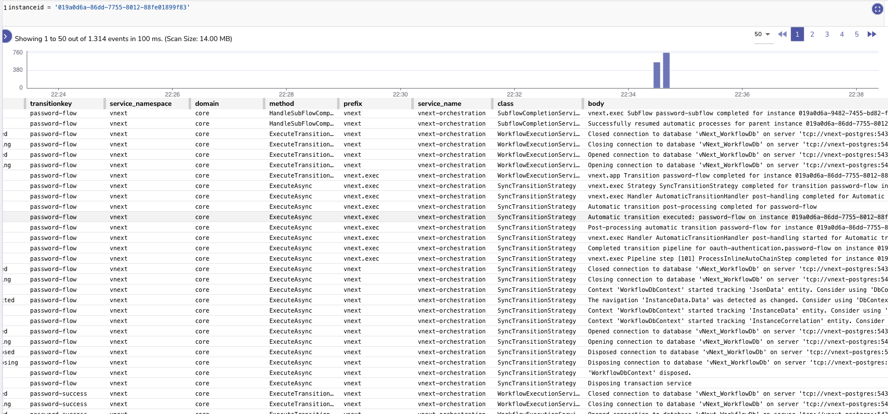
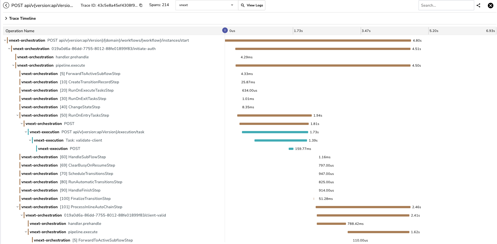
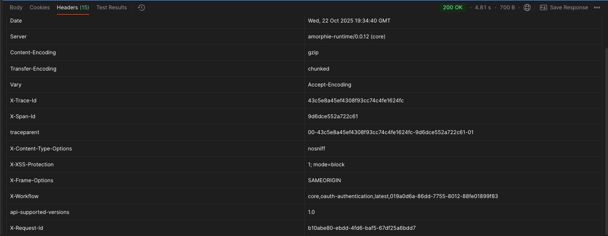

# vNext Runtime Platform - Release Notes v0.0.13
**Release Date:** October 23, 2025

## Overview
This release introduces significant enhancements to the vNext Runtime Platform, focusing on platform-specific view rendering, enhanced API endpoints, and comprehensive observability through OpenTelemetry instrumentation.

## 🚀 New Features

### Platform-based View Overrides (#56)
The platform now supports platform-specific view rendering, allowing different UI experiences for Android, iOS, and Web clients.

**Key Features:**
- Platform-specific content and display types
- Automatic platform detection via query parameters
- Fallback to default view when platform override is not available
- Support for multiple content types (JSON/Dynamic Flutter, HTML/Static)

**Supported Platforms:**
- `android` - Material Design components
- `ios` - Cupertino design components  
- `web` - HTML/CSS based rendering

**Display Types:**
- `full-page` - Full page display
- `popup` - Popup/modal display
- `bottom-sheet` - Bottom sheet display
- `top-sheet` - Top sheet display
- `drawer` - Drawer/side menu display
- `inline` - Inline display within page

**Example View Configuration:**
```json
{
  "key": "user-profile-view",
  "version": "1.0.0",
  "domain": "user-mgmt",
  "flow": "sys-views",
  "flowVersion": "1.0.0",
  "tags": ["profile", "user"],
  "attributes": {
    "type": "json/dynamic-flutter-v2/static",
    "content": "{ \"widget\": \"Text\", \"data\": \"Hello\" }",
    "display": "full-page",
    "labels": [
      { "language": "en-US", "label": "Profile" },
      { "language": "tr-TR", "label": "Profil" }
    ],
    "platformOverrides": {
      "android": {
        "content": "{ \"widget\": \"MaterialCard\", \"title\": \"Android Profile\" }",
        "display": "bottom-sheet"
      },
      "ios": {
        "content": "{ \"widget\": \"CupertinoPage\", \"title\": \"iOS Profile\" }"
      },
      "web": {
        "type": "html/static",
        "content": "<div class=\"profile\">Web Profile</div>",
        "display": "inline"
      }
    }
  }
}
```

## 🔧 API Enhancements

### View Endpoint Enhancement (#55)
Enhanced the view function endpoint to support platform-specific rendering.

**Endpoint:** `GET /:domain/workflows/:flowName/instances/:id/functions/view`

**Query Parameters:**
- `platform` (required) - Target platform: `android`, `ios`, or `web`

**Functionality:**
1. Checks if platform override exists in view configuration
2. Returns platform-specific content if available
3. Falls back to default view content if no override exists

### Function Data Endpoint Enhancement (#60)
Improved the function data endpoint with filtering and extension support.

**Endpoint:** `GET /:domain/workflows/:flowName/instances/:id/functions/data`

**Query Parameters:**
- `filter` - Data filtering criteria
- `extensions` - Additional data extensions to include

**Features:**
- Advanced data filtering capabilities
- Extensible data retrieval
- Optimized response payload

### Long Polling State Endpoint Enhancement (#74)
New state endpoint for real-time workflow state monitoring.

**Endpoint:** `GET /:domain/workflows/:flowName/instances/:id/functions/state`

**Features:**
- Real-time state updates
- Long polling support
- Efficient state change notifications

## 📊 Observability & Monitoring

### OpenTelemetry Instrumentation (#73)
Comprehensive observability implementation with OpenTelemetry for distributed tracing and structured logging.

**Instrumented Components:**
- Transition Pipeline execution
- Task handlers and processors
- Re-entry mechanisms
- HTTP request/response cycles

#### Logging Enhancements



**VNextLogEnricherProcessor Features:**
- Automatic log enrichment with contextual information
- Structured EventId numbering scheme
- Correlation with OpenTelemetry spans
- HTTP header propagation
- Custom attribute support

**Log Schema:**
```json
{
  "ts": "2025-10-11T10:30:45.123Z",
  "level": "Information",
  "message": "vnext.exec Transition auto-approve started for instance 8b3e...",
  "event.id": 10001,
  "event.name": "TransitionStarted",
  "category": "BBT.Workflow.Execution.Pipeline.TransitionPipeline",
  "prefix": "vnext.exec",
  "class": "TransitionPipeline",
  "method": "RunAsync",
  "domain": "amorphie",
  "flow": "loan-approval",
  "instanceId": "8b3e4a5c-...",
  "transitionKey": "auto-approve",
  "http.header.x-correlation-id": "abc123...",
  "http.header.x-request-id": "def456...",
  "environment": "development",
  "team": "workflow-team",
  "traceId": "4d5e6f...",
  "spanId": "1a2b3c..."
}
```

#### Distributed Tracing



**Span Hierarchy Example:**
```
00-a1b2c3d4e5f6... (TraceId)
├── POST /api/v1/execution/instances/{id}/transitions/{key}
│   ├── transition.execute: "abc-123/submit-application"
│   │   ├── handler.prehandle
│   │   ├── pipeline.execute
│   │   │   ├── [1] ValidateTransitionStep
│   │   │   ├── [2] ChangeStateStep
│   │   │   │   └── ✓ Event: state.changed (Draft → Submitted)
│   │   │   ├── [3] RunOnExecuteTasksStep
│   │   │   │   ├── task.execute: "validate-document"
│   │   │   │   ├── task.execute: "send-notification"
│   │   │   │   └── task.execute: "update-external-system"
│   │   │   ├── [4] HandleSubFlowStep
│   │   │   │   ├── subflow.start: "approval-workflow"
│   │   │   │   └── ✓ Event: subflow.initiated (type: S, correlation: xyz-789)
│   │   │   ├── [5] HandleFinishStep
│   │   │   │   ├── ✓ Event: workflow.completed (duration: 1250ms)
│   │   │   │   └── ✓ Event: completion.event.published (topic: flow.completed)
│   │   │   └── [6] SaveInstanceStep
│   │   └── handler.posthandle
```

#### Response Headers



**Automatic Header Injection:**
- `x-trace-id` - OpenTelemetry trace identifier
- `x-span-id` - Current span identifier
- `x-correlation-id` - Request correlation tracking
- `x-request-id` - Unique request identifier

#### EventId Strategy

**Structured EventId Numbering:**
- **10xxx**: Execution layer
- **20xxx**: Orchestration layer  
- **30xxx**: Infrastructure layer
- **40xxx**: Application layer
- **50xxx**: Domain layer

**Severity Ranges:**
- **xx01-xx39**: Information level
- **xx40-xx69**: Warning level
- **xx70-xx99**: Error level

**Telemetry Prefixes:**
- `vnext.exec` - Execution layer operations
- `vnext.app` - Application layer operations
- `vnext.orch` - Orchestration layer operations
- `vnext.infra` - Infrastructure layer operations
- `vnext.domain` - Domain layer operations

### Configuration Changes
New configuration sections added for:
- Platform override settings
- OpenTelemetry exporters
- Log enrichment rules
- Telemetry sampling rates

## 📞 Support
For technical support and questions, please contact the vNext Runtime Platform team.

---
**vNext Runtime Platform Team**  
October 23, 2025
