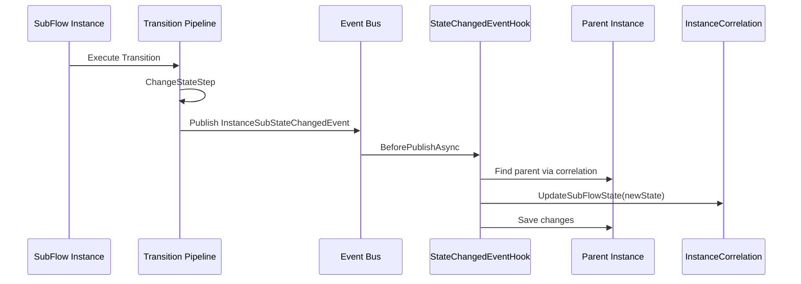
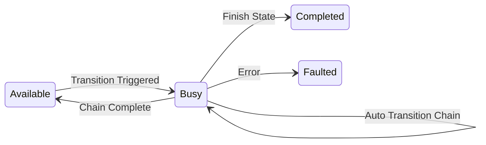

# vNext Runtime Platform - Release Notes v0.0.31
**Release Date:** January 13, 2026

## Overview
This release introduces significant new features including the GetInstances Task for cross-workflow data fetching, Subflow State Change Events with EffectiveState field, and Update Parent Data Transition for SubFlow-to-parent communication. Additionally, important bug fixes for HTTP request size limits, extension query string formatting, array merge behavior, and correlation conflict handling have been implemented.

---

## New Features

### 1. GetInstances Task
Added a new task type for fetching instance data from other workflows with pagination and filtering support.

**Details:**
- Task Type: `15`
- Enables cross-workflow data queries
- Supports pagination with `page` and `pageSize` parameters
- Supports sorting with `sort` parameter (e.g., `-CreatedAt` for descending)
- Supports filtering with `filter` array parameter
- Optional Dapr service invocation support

**Task Configuration:**
```json
{
  "key": "fetch-orders",
  "version": "1.0.0",
  "domain": "core",
  "flow": "sys-tasks",
  "flowVersion": "1.0.0",
  "tags": ["data-fetch", "workflow-communication"],
  "attributes": {
    "type": "15",
    "config": {
      "domain": "core",
      "flow": "order-flow",
      "page": 1,
      "pageSize": 10,
      "sort": "-CreatedAt"
    }
  }
}
```

**Config Parameters:**

| Parameter | Type | Required | Default | Description |
|-----------|------|----------|---------|-------------|
| `domain` | string | Yes | - | Target workflow domain |
| `flow` | string | Yes | - | Target workflow name |
| `page` | int | No | 1 | Page number (1-based) |
| `pageSize` | int | No | 10 | Number of items per page |
| `sort` | string | No | - | Sort field and direction (prefix with `-` for descending) |
| `filter` | string[] | No | - | Filter expressions array |
| `useDapr` | bool | No | false | Use Dapr service invocation instead of direct HTTP |

> **Reference:** [#272 - Add Filter Support to GetInstances Task](https://github.com/burgan-tech/vnext/issues/272)

---

### 2. Subflow State Change Event Implementation
Implemented `InstanceSubStateChangedEvent` that fires when a subflow instance changes state, updating the parent's correlation and exposing EffectiveState.

**Details:**
- New `EffectiveState` field on Instance entity
- Automatically tracks subflow state in parent correlation
- Enables accurate long-polling state display
- Migration automatically applied

**Behavior:**
- If an instance has an active subflow, `EffectiveState` reflects the subflow's current state
- If an instance has no subflow dependency, `EffectiveState` reflects its own state
- Parent instance receives state change events from subflows

**Architecture:**


> **Reference:** [#297 - Subflow State Change Event Implementation](https://github.com/burgan-tech/vnext/issues/297)

---

### 3. Update Parent Data Transition
Added a special transition type for updating parent workflow instance data from SubFlow states.

**Details:**
- Special transition for SubFlow states only
- Target is always `$self` (no state change)
- Updates parent instance data without advancing the flow
- Uses `update-parent-data` well-known transition key

**Workflow Configuration:**
```json
{
  "updateData": {
    "key": "update-parent",
    "target": "$self",
    "triggerType": 0,
    "versionStrategy": "None",
    "labels": [
      { "language": "en", "label": "Update Parent Data" },
      { "language": "tr", "label": "Parent Veri Güncelle" }
    ]
  }
}
```

**What It Does:**
- Data mapping (according to transition data mapping rules)
- Instance data update
- Instance key validation and setting
- Transition record creation
- Tag addition (if any)

**What It Does NOT Do:**
- State change (target is `$self`)
- SubFlow advancement
- Auto transition invocation
- OnExit/OnEntry task execution
- State change event publishing

> **Reference:** [#238 - Direct Trigger Task for Parent Transition](https://github.com/burgan-tech/vnext/issues/238)

---

### 4. GraphQL-Style Filtering for Instance Data
Implemented comprehensive GraphQL-style filtering support for instance data queries.

**Features:**
- Filter on Instance columns (`key`, `status`, `state`, `createdAt`, etc.)
- Filter on JSON data fields using `attributes` prefix
- 13 comparison operators (`eq`, `ne`, `gt`, `ge`, `lt`, `le`, `between`, `like`, `startswith`, `endswith`, `in`, `nin`, `isnull`)
- Logical operators (`AND`, `OR`, `NOT`)
- Group By with aggregations (`count`, `sum`, `avg`, `min`, `max`)

**Supported Routes:**
```
GET /{domain}/workflows/{workflow}/functions/data?filter={...}
GET /{domain}/workflows/{workflow}/instances?filter={...}
```

**Example - Filter by Status and Amount:**
```http
GET /banking/workflows/payment/functions/data?filter={"status":{"eq":"Active"},"attributes":{"amount":{"gt":"1000"}}}
```

**Example - Logical OR:**
```http
GET /banking/workflows/payment/functions/data?filter={"or":[{"status":{"eq":"Active"}},{"status":{"eq":"Busy"}}]}
```

> **Documentation:** [Instance Filtering Guide](doc/en/flow/instance-filtering.md)  
> **Reference:** [#202 - Implement GraphQL-Style Filtering for Instance Data](https://github.com/burgan-tech/vnext/issues/202)

---

### 5. Flexible Version Resolution in References
Version references now support multiple resolution strategies for component versions.

**Supported Formats:**

| Format | Description | Example Result |
|--------|-------------|----------------|
| `"latest"` | Always resolves to the newest version | Latest published |
| `"1.0.0"` | Exact version match | 1.0.0 |
| `"1.0"` | Resolves to highest patch in Major.Minor series | 1.0.5 |
| `"1"` | Resolves to highest version in Major series | 1.9.3 |

**Example Usage:**
```json
{
  "key": "validate-client",
  "domain": "core",
  "version": "latest",
  "flow": "sys-tasks"
}
```

> **Documentation:** [Reference Schema - Version Strategies](doc/en/principles/reference.md#version-strategies)  
> **Reference:** [#209 - Support "latest" String Value in References](https://github.com/burgan-tech/vnext/issues/209)

---

### 6. Enhanced Error Handling System (ErrorBoundary)
Implemented comprehensive error handling with multi-level error resolution and priority-based execution.

**Features:**
- Multi-level error boundaries (Global, State, Task)
- Priority-based rule evaluation (lower number = higher priority)
- 6 error actions: Abort, Retry, Rollback, Ignore, Notify, Log
- Retry policies with exponential backoff and jitter
- Error filtering by type and code

**Error Resolution Hierarchy:**
```
Task-level → State-level → Global-level → System Default
```

**Example Configuration:**
```json
{
  "errorBoundary": {
    "onError": [
      {
        "action": 1,
        "errorCodes": ["Task:503", "Task:504"],
        "priority": 10,
        "retryPolicy": {
          "maxRetries": 3,
          "initialDelay": "PT5S",
          "backoffType": 1
        }
      },
      {
        "action": 0,
        "errorCodes": ["*"],
        "transition": "error-state",
        "priority": 999
      }
    ]
  }
}
```

> **Note:** `onTimeout` property exists in schema but is not yet implemented.

> **Documentation:** [Error Boundary Guide](doc/en/flow/error-boundary.md)  
> **Reference:** [#88 - Enhanced Error Handling System](https://github.com/burgan-tech/vnext/issues/88)

---

## Bug Fixes

### 1. Request Size Issue Fix
Fixed HTTP client and handler size limits to prevent failures when handling large request and response payloads.

**Problem:**
- Large HTTP request/response payloads caused failures due to buffer limits

**Solution:**
- Increased HTTP client buffering and header limits to accommodate larger payloads

> **Reference:** [#303 - Request size issue fix](https://github.com/burgan-tech/vnext/pull/303)

---

### 2. Extension Query String Formatting Fix
Fixed incorrect query string formatting for extensions parameter.

**Problem:**
- Multiple extensions were incorrectly combined with commas in a single parameter
- Current behavior: `?extensions=ext1,ext2,ext3`

**Solution:**
- Each extension is now added as a separate query parameter
- Correct behavior:
```
?extensions=ext1
&extensions=ext2
&extensions=ext3
```

> **Reference:** [#273 - Incorrect query string formatting for extensions parameter](https://github.com/burgan-tech/vnext/issues/273)

---

### 3. Array Merge Behavior Change
Changed InstanceData merge logic to replace arrays instead of merging them.

**Problem:**
- Deep merge for arrays caused unintended behavior
- Removing items from arrays was not possible
- Array updates were non-deterministic

**Solution:**
- Arrays are now fully replaced (not merged)
- Objects continue to use deep merge behavior
- Primitives continue to be replaced

**Merge Behavior:**
| Type | Behavior |
|------|----------|
| Array | Replace |
| Object | Merge |
| Primitive | Replace |

**Example:**

Current data:
```json
{ "items": [{ "id": 1 }, { "id": 2 }] }
```

Incoming payload:
```json
{ "items": [{ "id": 2 }] }
```

Result (before - incorrect):
```json
{ "items": [{ "id": 1 }, { "id": 2 }, { "id": 2 }] }
```

Result (after - correct):
```json
{ "items": [{ "id": 2 }] }
```

> **Reference:** [#294 - Change merge behavior to replace arrays instead of merging](https://github.com/burgan-tech/vnext/issues/294)

---

### 4. Correlation InstanceId Conflict Handling
Fixed correlation instanceId mismatch when subflow returns a different instanceId due to idempotency.

**Problem:**
- Parent flow creates correlation with a generated instanceId
- Subflow detects an active instance with the same key
- Due to idempotency, subflow returns existing instanceId
- Correlation and actual subflow instance become inconsistent

**Solution:**
- Client requests maintain idempotency behavior
- Service-to-service platform calls now return `409 Conflict`
- Prevents incorrect sub-correlation creation

> **Reference:** [#274 - Correlation instanceId is not updated when subflow returns a different instanceId due to idempotency](https://github.com/burgan-tech/vnext/issues/274)

---

## Hotfixes

### 1. Workflow Instance Busy/Active Status Management
Implemented proper Busy/Available status management for workflow instances.

**Details:**
- Instance is "Busy" during transition processing
- Instance becomes "Available" when processing completes and target state has only manual transitions
- Same rules apply to both main flow and subflow instances

**Status Flow:**


**Status Meanings:**
| Status | Meaning |
|--------|---------|
| Busy | Processing in progress, cannot accept new transitions |
| Available | Ready for client to trigger manual transition |
| Completed | Workflow finished |
| Faulted | Error state |

> **Reference:** [#288 - Workflow Instance Busy/Active Status Management](https://github.com/burgan-tech/vnext/issues/288)

---

### 2. Publish Component Timeout Fix
Resolved timeout issues for long-running publish component operations in init-service.

**Problem:**
- Publishing components can take a long time due to runtime waiting, package downloading, and file processing
- HTTP requests timeout before completion

**Solution:**
- Added configurable server timeout environment variables
- Default timeout increased to 10 minutes

**New Environment Variables:**
| Variable | Description | Default |
|----------|-------------|---------|
| `SERVER_TIMEOUT_MS` | Total request timeout in milliseconds | `600000` (10 min) |
| `SERVER_KEEP_ALIVE_TIMEOUT_MS` | Keep-alive connection timeout | `600000` (10 min) |
| `SERVER_HEADERS_TIMEOUT_MS` | Headers timeout (must be > keep-alive) | `610000` (10 min + 10 sec) |

**Example Configuration (30 minutes):**
```yaml
services:
  vnext-init:
    environment:
      SERVER_TIMEOUT_MS: 1800000
      SERVER_KEEP_ALIVE_TIMEOUT_MS: 1800000
      SERVER_HEADERS_TIMEOUT_MS: 1810000
```

> **Reference:** [#268 - Publish component request times out for long-running operations](https://github.com/burgan-tech/vnext/issues/268)

---

## Improvements

### 1. C# 12 Script Engine Support
The script engine compiler now supports C# 12 features for mapping scripts.

**Benefits:**
- Collection expressions
- Primary constructors
- Inline arrays
- Optional parameters in lambda expressions

---

### 2. System.Text.Json Default Using
`System.Text.Json` namespace is now included in default usings for script mappings.

**Before:**
```csharp
using System.Text.Json;
// ... then use JsonSerializer
```

**After:**
```csharp
// JsonSerializer is available directly
var json = JsonSerializer.Serialize(data);
```

---

### 3. Automatic Cache Invalidation After Deploy
Cache is now automatically cleared after each component deployment to ensure consistency.

**Details:**
- Re-initialize is triggered after every deploy operation
- Guarantees that cached definitions are refreshed
- Prevents stale cache issues after component updates

---

## Configuration Updates

Configuration for v0.0.31:
```json
{
  "runtimeVersion": "31",
  "schemaVersion": "0.0.30",
  "componentVersion": "0.0.18"
}
```

---

## Issues Referenced

**Features:**
- [#88 - Enhanced Error Handling System](https://github.com/burgan-tech/vnext/issues/88)
- [#202 - Implement GraphQL-Style Filtering for Instance Data](https://github.com/burgan-tech/vnext/issues/202)
- [#209 - Support "latest" String Value in References](https://github.com/burgan-tech/vnext/issues/209)
- [#238 - Direct Trigger Task for Parent Transition](https://github.com/burgan-tech/vnext/issues/238)
- [#272 - Add Filter Support to GetInstances Task](https://github.com/burgan-tech/vnext/issues/272)
- [#297 - Subflow State Change Event Implementation](https://github.com/burgan-tech/vnext/issues/297)

**Bug Fixes:**
- [#273 - Incorrect query string formatting for extensions parameter](https://github.com/burgan-tech/vnext/issues/273)
- [#274 - Correlation instanceId conflict handling](https://github.com/burgan-tech/vnext/issues/274)
- [#294 - Change merge behavior to replace arrays instead of merging](https://github.com/burgan-tech/vnext/issues/294)
- [#303 - Request size issue fix](https://github.com/burgan-tech/vnext/pull/303)

**Hotfixes:**
- [#268 - Publish component request times out for long-running operations](https://github.com/burgan-tech/vnext/issues/268)
- [#288 - Workflow Instance Busy/Active Status Management](https://github.com/burgan-tech/vnext/issues/288)

---

## Summary

With this release:
- GetInstances Task for cross-workflow data fetching implemented
- Subflow State Change Events with EffectiveState field added
- Update Parent Data Transition for SubFlow-to-parent communication implemented
- GraphQL-style filtering for instance data added
- Flexible version resolution ("latest", Major, Major.Minor) in references added
- Enhanced Error Handling System (ErrorBoundary) with multi-level error boundaries
- HTTP request size limits increased
- Extension query string formatting fixed
- Array merge behavior changed to replace mode
- Correlation conflict handling improved with 409 response
- Instance Busy/Available status management implemented
- Init-service timeout configuration added
- Automatic cache invalidation after deploy added
- C# 12 script engine support added
- System.Text.Json added to default usings

---

## Upgrade Path

### From v0.0.30 to v0.0.31:

1. **Update Runtime:**
   ```bash
   git pull origin master
   ```

2. **Update Configuration:**
   ```json
   {
     "runtimeVersion": "31",
     "schemaVersion": "0.0.31",
     "componentVersion": "0.0.18"
   }
   ```

3. **(Optional) Configure Init-Service Timeouts:**
   If you experience timeout issues during package publishing, configure the timeout environment variables:
   ```yaml
   SERVER_TIMEOUT_MS: 1800000
   SERVER_KEEP_ALIVE_TIMEOUT_MS: 1800000
   SERVER_HEADERS_TIMEOUT_MS: 1810000
   ```

4. **Database Migration:**
   The `EffectiveState` field migration is applied automatically on startup.

---

**vNext Runtime Platform Team**  
January 13, 2026
