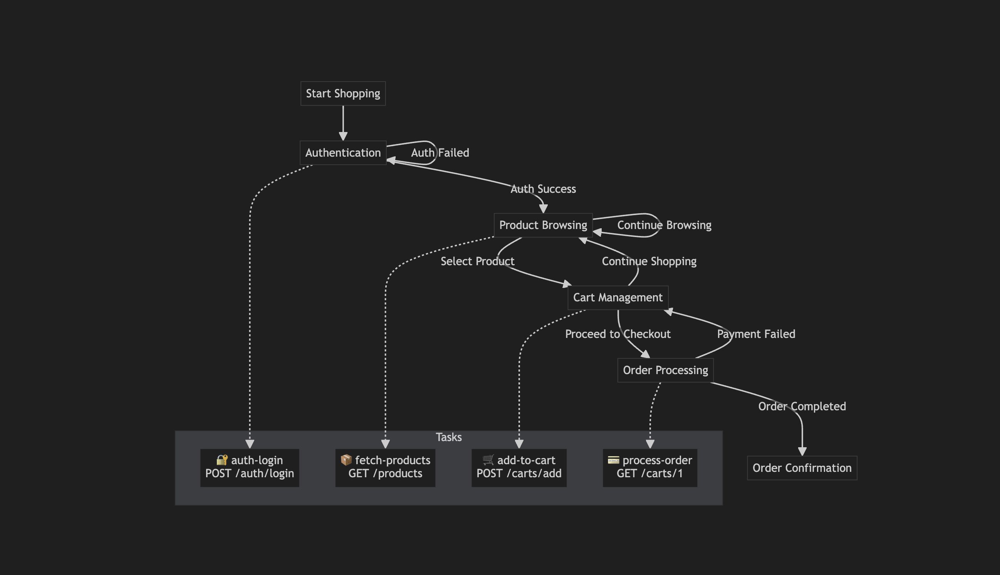

# E-Commerce Workflow - API Test Guide

This folder contains the necessary files to test the e-commerce workflow.

## 📁 Files

- `ecommerce-workflow.http` - HTTP requests test file
- `README-ecommerce-workflow-en.md` - This file, workflow documentation (English)
- `README-ecommerce-workflow-tr.md` - Workflow documentation (Turkish)

## 🔄 E-Commerce Workflow Flow

### Overview

This workflow simulates a complete e-commerce experience and includes the following states:

1. **Authentication** (Initial State)
2. **Product Browsing** (Intermediate State)
3. **Cart Management** (Intermediate State)
4. **Order Processing** (Intermediate State)
5. **Order Confirmation** (Final State)

### State Diagram



### Workflow States & Flow

#### 1. 🔐 Authentication (Initial State)
- **Entry Action:** Login task is executed
- **Success Case:** Transitions to Product Browsing state
- **Failure Case:** Remains in Authentication state (retry)

#### 2. 🛒 Product Browsing (Intermediate State)
- **Entry Action:** Products are fetched
- **User Actions:**
  - Product selection → Transitions to Cart Management state
  - Continue browsing → Remains in Product Browsing state

#### 3. 🛍️ Cart Management (Intermediate State)  
- **Entry Action:** Selected product is added to cart
- **User Actions:**
  - Proceed to checkout → Transitions to Order Processing state
  - Continue shopping → Returns to Product Browsing state

#### 4. 📦 Order Processing (Intermediate State)
- **Entry Action:** Order is processed
- **Success Case:** Transitions to Order Confirmation state  
- **Payment Failure:** Returns to Cart Management state

#### 5. ✅ Order Confirmation (Final State)
- **Status:** End of workflow
- **Result:** Workflow completes

### Detailed Flow

#### 1. 🚀 Start Shopping

**Endpoint:** `POST /api/v1/core/workflows/ecommerce/instances/start`

**Purpose:** Initiates a new e-commerce session and performs user authentication.

**Request Data:**
- `key`: Unique session key
- `tags`: Tags to categorize the workflow  
- `attributes`: User information (username, password, token duration)

**Response:**
- You receive a unique `id`
- `currentState`: "authentication" 
- `status`: "Active"

#### 2. 🛍️ Product Selection (Select Product)

**Endpoint:** `PATCH /api/v1/core/workflows/ecommerce/instances/{id}/transitions/select-product`

**Purpose:** Adds the user's selected product to the cart.

**Request Data:**
- `id`: Product ID

**Response:**
- `currentState`: "cart-management"
- `availableTransitions`: 
  - `proceed-to-checkout` (Go to checkout)
  - `continue-shopping` (Continue shopping)

#### 2.1 🔄 Continue Shopping

**Endpoint:** `PATCH /api/v1/core/workflows/ecommerce/instances/{id}/transitions/continue-shopping`

**Purpose:** Returns the user to product browsing mode.

**Response:**
- `currentState`: "product-browsing"
- `availableTransitions`:
  - `select-product` (Select product)
  - `continue-browsing` (Continue browsing)

#### 3. 💳 Proceed to Checkout

**Endpoint:** `PATCH /api/v1/core/workflows/ecommerce/instances/{id}/transitions/proceed-to-checkout`

**Purpose:** Initiates order processing and saves product details.

**Request Data:**
- Product details (name, ingredients, instructions)
- Cooking information (prep time, cook time)
- User and rating information

**Response:**
- `currentState`: "order-processing"
- `availableTransitions`: [] (Workflow completed)

## 🎯 Detailed State Flow Diagram

```
[Start Workflow] 
   ↓
[Authentication] ── (login success) ──→ [Product Browsing]
   ↑                                           ↓
   └── (login failure) ─────────────────────┘  ↓ (select-product)
                                              ↓
[Cart Management] ←── (continue-shopping) ──┘
   ↓ ↺ (continue-shopping)
   ↓ (proceed-to-checkout) 
   ↓
[Order Processing] ── (payment failure) ──→ [Cart Management]
   ↓ (success)
[Order Confirmation]
   ↓
[End Workflow]
```

### State Transition Summary

| Current State | Possible Transitions | Target State |
|-------------|----------------|-------------|
| Authentication | login success | Product Browsing |
| Authentication | login failure | Authentication (retry) |
| Product Browsing | select-product | Cart Management |
| Product Browsing | continue-browsing | Product Browsing |
| Cart Management | proceed-to-checkout | Order Processing |
| Cart Management | continue-shopping | Product Browsing |
| Order Processing | success | Order Confirmation |
| Order Processing | payment failure | Cart Management |
| Order Confirmation | - | End (Final) |

## 🔧 Testing

1. Open the `ecommerce-workflow.http` file in an HTTP client (VS Code REST Client, Postman, etc.)
2. Execute requests in sequence:
   - First, run the "Start Shopping" request
   - Get the `id` value from the response and replace it in other request URLs
   - Execute other requests in order

## 📝 Notes

- Automatic actions are executed when entering each state (login task, product fetch, cart add, order process)
- The `availableTransitions` array returned at each step shows the next possible actions
- The `currentState` field indicates which state the workflow is in
- State transitions can be made as long as the workflow instance is active
- In failure cases (login failure, payment failure), the workflow returns to the relevant state
- Order Confirmation is the final state and the workflow ends here

## 🌐 Headers

The following headers are used in test requests:
- `Accept-Language`: For localization (tr-TR)
- `X-Request-Id`: Unique ID for request tracking
- `X-Device-Id`: Device identification
- `X-Token-Id`: Token identification  
- `X-Device-Info`: Device information
- `X-Forwarded-For`: IP address information
