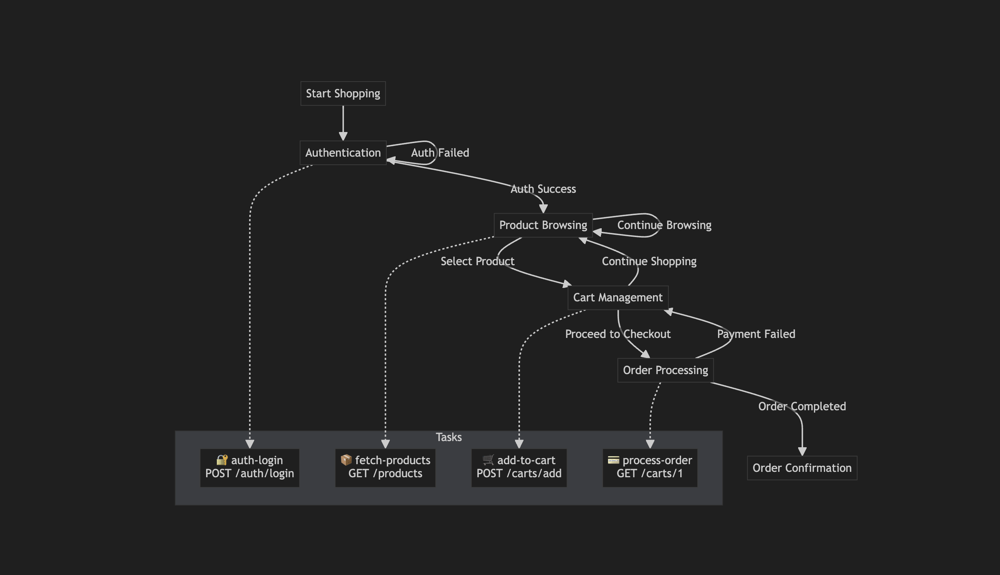

# E-Commerce Workflow - API Test Guide

Bu klasör, e-ticaret iş akışını test etmek için gerekli dosyaları içerir.

## 📁 Dosyalar

- `ecommerce-workflow.http` - HTTP istekleri için test dosyası
- `README-ecommerce-workflow-en.md` - İş akışının açıklaması (İngilizce)
- `README-ecommerce-workflow-tr.md` - Bu dosya, iş akışının açıklaması (Türkçe)

## 🔄 E-Commerce Workflow Akışı

### Genel Bakış

Bu iş akışı tam bir e-ticaret deneyimini simüle eder ve aşağıdaki state'leri içerir:

1. **Authentication** (Başlangıç State'i)
2. **Product Browsing** (Ara State)
3. **Cart Management** (Ara State)
4. **Order Processing** (Ara State)
5. **Order Confirmation** (Son State)

### State Diyagramı



### Workflow States & Flow

#### 1. 🔐 Authentication (Initial State)
- **Giriş Aksiyonu:** Login task çalıştırılır
- **Başarı Durumu:** Product Browsing state'ine geçer
- **Başarısızlık Durumu:** Authentication state'inde kalır (retry)

#### 2. 🛒 Product Browsing (Intermediate State)
- **Giriş Aksiyonu:** Ürünler fetch edilir
- **Kullanıcı Aksiyonları:**
  - Ürün seçimi → Cart Management state'ine geçer
  - Browsing'e devam → Product Browsing state'inde kalır

#### 3. 🛍️ Cart Management (Intermediate State)  
- **Giriş Aksiyonu:** Seçilen ürün sepete eklenir
- **Kullanıcı Aksiyonları:**
  - Checkout'a geç → Order Processing state'ine geçer
  - Alışverişe devam → Product Browsing state'ine geri döner

#### 4. 📦 Order Processing (Intermediate State)
- **Giriş Aksiyonu:** Sipariş işlenir
- **Başarı Durumu:** Order Confirmation state'ine geçer  
- **Ödeme Hatası:** Cart Management state'ine geri döner

#### 5. ✅ Order Confirmation (Final State)
- **Durum:** Workflow'un sonu
- **Sonuç:** İş akışı tamamlanır

### Detaylı Akış

#### 1. 🚀 Alışverişe Başlama (Start Shopping)

**Endpoint:** `POST /api/v1/core/workflows/ecommerce/instances/start`

**Amaç:** Yeni bir e-ticaret oturumu başlatır ve kullanıcı kimlik doğrulaması yapar.

**Gönderilen Veriler:**
- `key`: Benzersiz oturum anahtarı
- `tags`: İş akışını kategorize etmek için etiketler  
- `attributes`: Kullanıcı bilgileri (username, password, token süresi)

**Yanıt:**
- Benzersiz bir `id` alırsınız
- `currentState`: "authentication" 
- `status`: "Active"

#### 2. 🛍️ Ürün Seçimi (Select Product)

**Endpoint:** `PATCH /api/v1/core/workflows/ecommerce/instances/{id}/transitions/select-product`

**Amaç:** Kullanıcının seçtiği ürünü sepete ekler.

**Gönderilen Veriler:**
- `id`: Ürün ID'si

**Yanıt:**
- `currentState`: "cart-management"
- `availableTransitions`: 
  - `proceed-to-checkout` (Ödemeye geç)
  - `continue-shopping` (Alışverişe devam et)

#### 2.1 🔄 Alışverişe Devam (Continue Shopping)

**Endpoint:** `PATCH /api/v1/core/workflows/ecommerce/instances/{id}/transitions/continue-shopping`

**Amaç:** Kullanıcıyı ürün browsing moduna geri döndürür.

**Yanıt:**
- `currentState`: "product-browsing"
- `availableTransitions`:
  - `select-product` (Ürün seç)
  - `continue-browsing` (Browsing'e devam)

#### 3. 💳 Ödemeye Geçiş (Proceed to Checkout)

**Endpoint:** `PATCH /api/v1/core/workflows/ecommerce/instances/{id}/transitions/proceed-to-checkout`

**Amaç:** Sipariş işlemini başlatır ve ürün detaylarını kaydeder.

**Gönderilen Veriler:**
- Ürün detayları (ad, malzemeler, talimatlar)
- Pişirme bilgileri (hazırlık zamanı, pişirme zamanı)
- Kullanıcı ve değerlendirme bilgileri

**Yanıt:**
- `currentState`: "order-processing"
- `availableTransitions`: [] (İş akışı tamamlandı)

## 🎯 Detaylı State Akış Diyagramı

```
[Start Workflow] 
   ↓
[Authentication] ── (login success) ──→ [Product Browsing]
   ↑                                           ↓
   └── (login failure) ─────────────────────┘  ↓ (select-product)
                                              ↓
[Cart Management] ←── (continue-shopping) ──┘
   ↓ ↺ (continue-shopping)
   ↓ (proceed-to-checkout) 
   ↓
[Order Processing] ── (payment failure) ──→ [Cart Management]
   ↓ (success)
[Order Confirmation]
   ↓
[End Workflow]
```

### State Transition Özeti

| Mevcut State | Olası Geçişler | Hedef State |
|-------------|----------------|-------------|
| Authentication | login success | Product Browsing |
| Authentication | login failure | Authentication (retry) |
| Product Browsing | select-product | Cart Management |
| Product Browsing | continue-browsing | Product Browsing |
| Cart Management | proceed-to-checkout | Order Processing |
| Cart Management | continue-shopping | Product Browsing |
| Order Processing | success | Order Confirmation |
| Order Processing | payment failure | Cart Management |
| Order Confirmation | - | End (Final) |

## 🔧 Test Etme

1. `ecommerce-workflow.http` dosyasını bir HTTP client (VS Code REST Client, Postman, vb.) ile açın
2. Sırasıyla istekleri çalıştırın:
   - İlk olarak "Start Shopping" isteğini çalıştırın
   - Yanıttan `id` değerini alın ve diğer isteklerdeki URL'lerde değiştirin
   - Diğer istekleri sırasıyla çalıştırın

## 📝 Notlar

- Her state'e giriş sırasında otomatik aksiyonlar çalıştırılır (login task, product fetch, cart add, order process)
- Her adımda dönen `availableTransitions` array'i bir sonraki olası aksiyonları gösterir
- `currentState` field'ı iş akışının hangi durumda olduğunu belirtir
- Workflow instance'ı aktif kaldığı sürece state geçişleri yapılabilir
- Başarısızlık durumlarında (login failure, payment failure) workflow ilgili state'e geri döner
- Order Confirmation final state'idir ve workflow burada sonlanır

## 🌐 Headers

Test isteklerinde aşağıdaki header'lar kullanılır:
- `Accept-Language`: Lokalizasyon için (tr-TR)
- `X-Request-Id`: İstek takibi için benzersiz ID
- `X-Device-Id`: Cihaz tanımlama
- `X-Token-Id`: Token tanımlama  
- `X-Device-Info`: Cihaz bilgisi
- `X-Forwarded-For`: IP adresi bilgisi
